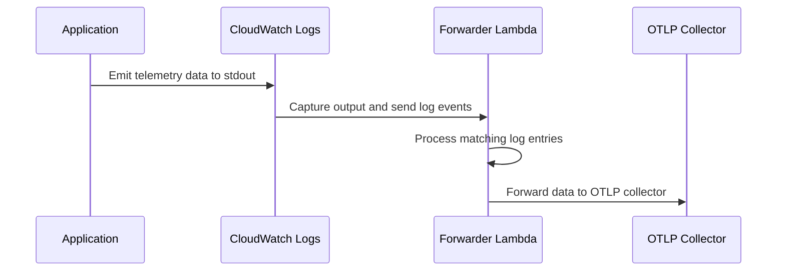

# Lambda OTLP Forwarder

[](https://opensource.org/licenses/MIT)
[](https://opentelemetry.io)

[](https://www.rust-lang.org)
[](https://www.python.org)
[](https://nodejs.org)


## Overview

The Lambda OTLP Forwarder enables serverless applications to send OpenTelemetry data to collectors without the overhead of direct connections or sidecars. It works by:

1. Capturing telemetry data through CloudWatch Logs
2. Processing and forwarding to your OTLP collector
3. Supporting multiple programming languages and frameworks

### Why Use Lambda OTLP Forwarder?

- 🚀 **Reduced Latency**: Minimal impact on Lambda execution and cold start times
- 🔒 **Enhanced Security**: Keeps telemetry data within AWS infrastructure
- 💰 **Cost Optimization**: Reduces Lambda billed execution time, and supports compression and efficient protocols to reduce the ingestion costs

### Why not use the OTEL/ADOT Lambda Layer extension?

This project was created to address the challenges of efficiently sending telemetry data from serverless applications to OTLP collectors without adding to cold start times, or affecting runtime performances. The current approaches using the OTEL/ADOT Lambda Layer extension deploys a sidecar agent, which increases resource usage, slows cold starts, and drives up costs. This becomes particularly problematic when running Lambda functions with limited memory, as the [overhead of initializing and running the ADOT/OTEL layer](https://github.com/aws-observability/aws-otel-lambda/issues/228) can negate any cost savings from memory optimization. 

This solution provides a streamlined approach that maintains full telemetry capabilities while keeping resource consumption and costs minimal.
As a side benefit, if you're running an OTEL collector in your VPC to benefit from the advanced filtering and sampling capabilities, you don't need to expose it to the internet or connect all your lambda functions to your VPC. Since the transport for OLTP is CloudWatch logs, you are keeping all your telemetry data internal.
The downsides are:
- You will incur CloudWatch Logs ingestion charges for the telemetry data, which can be significant if you're instrumenting a high volume of requests. You can minimize this by using compression and protobuf instead of json.
- You will incur additional costs for the forwarder Lambda function, which I wouldn't consider significant compared to the overall cost of your observability stack, but it's not zero.
- At this stage, no automatic instrumentation is supported, so you would need at the very least to add the instrumentation libraries to your application for the services that you are using.


> [!NOTE]
> AWS has recently announced [Cloudwatch Application Signals for Lambda](https://aws.amazon.com/about-aws/whats-new/2024/11/aws-lambda-application-performance-monitoring-cloudwatch-signals/) and a new set of OpenTelemetry layers for Python and Node.js, which are not using the sidecar approach, and provide better cold start and warm start performances compared to the ADOT/OTEL layer. The UDP based X-Ray localhost endpoint for Lambda now accepts OTLP (over UDP) data, and this allows much lower latency for the telemetry data to be sent to the collector. The Lambda OTLP Forwarder _now supports sending telemetry data to the Cloudwatch Application Signals OTLP endpoint_, so you can use it as your Observability platform as an alternative to the other vendors in this space.
>
> **Experimental Feature**: The Lambda OTLP Forwarder also includes an experimental processor specifically for AWS Application Signals spans. This processor is provided mainly for demonstration purposes and should not be enabled simultaneously with the OTLP stdout processor to avoid potential conflicts. See the Configuration section for details on how to select the appropriate processor for your use case.


## Supported Languages
At this time, the languages supported (just experimentally) are Rust, Python, and Node.js. Java should probably be next, and I'd welcome contributions for other languages.
In general, the approach is to add the "ouput to stdout" capability is to use the OTEL SDK for the language to generate and format the telemetry data, and then to replace the OTLP exporter (or a part of it) with a custom implementation that would instead write to stdout. 

> [!IMPORTANT]
> While this approach may be a little bit _hacky_, it may not be necessary in future, as the OpenTelemetry community is working on a new [OTLP Stdout exporter specification](https://github.com/open-telemetry/opentelemetry-specification/pull/4183) that would allow to potentially not depend on a custom implementation at all.

### Rust
[code](packages/rust/otlp-stdout-client) | [docs](packages/rust/otlp-stdout-client/README.md) | [crates.io](https://crates.io/crates/otlp-stdout-client) | [examples](packages/rust/otlp-stdout-client/examples)

```rust
use aws_lambda_events::event::apigw::ApiGatewayProxyRequest;
use lambda_runtime::{service_fn, Error, LambdaEvent};
use serde_json::Value;
use opentelemetry_otlp::{WithExportConfig, WithHttpConfig};
use otlp_stdout_client::StdoutClient;

async fn function_handler(_event: LambdaEvent<ApiGatewayProxyRequest>) -> Result<Value, Error> {
    Ok(serde_json::json!({"message": "Hello from Lambda!"}))
}

#[tokio::main]
async fn main() -> Result<(), Error> {
    // Initialize tracer provider with the new builder pattern
    let exporter = opentelemetry_otlp::SpanExporter::builder()
        .with_http()
        .with_http_client(StdoutClient::default())
        .build()?;
    
    let tracer_provider = opentelemetry_sdk::trace::TracerProvider::builder()
        .with_simple_exporter(exporter)
        .build();

    opentelemetry::global::set_tracer_provider(tracer_provider.clone());
    
    // Create a service with a tracing layer
    let service = tower::ServiceBuilder::new()
        .layer(opentelemetry_aws::lambda::LambdaLayer::new())
        .service(service_fn(function_handler));

    // Run the Lambda runtime
    lambda_runtime::run(service).await?;

    // Ensure traces are flushed
    tracer_provider.force_flush();
    Ok(())
}
```

### Python
[code](packages/python/adapter) | [docs](packages/python/adapter/README.md) | [pypi](https://pypi.org/project/otlp-stdout-adapter/) | [examples](packages/python/adapter/examples)

```python
from opentelemetry import trace
from opentelemetry.sdk.trace import TracerProvider
from opentelemetry.sdk.trace.export import BatchSpanProcessor
from opentelemetry.exporter.otlp.proto.http.trace_exporter import OTLPSpanExporter
from otlp_stdout_adapter import StdoutAdapter, get_lambda_resource
from opentelemetry.trace import SpanKind
from contextlib import contextmanager

def init_telemetry(service_name: str = __name__) -> tuple[trace.Tracer, TracerProvider]:
    """Initialize OpenTelemetry with AWS Lambda-specific configuration"""
    provider = TracerProvider(resource=get_lambda_resource())
    
    provider.add_span_processor(BatchSpanProcessor(
        OTLPSpanExporter(
            session=StdoutAdapter().get_session(),
            timeout=5
        )
    ))

    trace.set_tracer_provider(provider)
    return trace.get_tracer(service_name), provider

# Initialize tracer
tracer, tracer_provider = init_telemetry()

@contextmanager
def force_flush(tracer_provider):
    """Ensure traces are flushed even if Lambda freezes"""
    try:
        yield
    finally:
        tracer_provider.force_flush()

def lambda_handler(event, context):
    with force_flush(tracer_provider), tracer.start_as_current_span(
        "lambda-invocation",
        kind=SpanKind.SERVER
    ) as span:
        try:
            result = {"message": "Hello from Lambda!"}
            return {
                "statusCode": 200,
                "body": json.dumps(result)
            }
        except Exception as e:
            span.record_exception(e)
            span.set_status(trace.StatusCode.ERROR, str(e))
            raise
```

### Node
[code](packages/node/exporter) | [docs](packages/node/exporter/README.md) | [npm](https://www.npmjs.com/package/@dev7a/otlp-stdout-exporter) | [examples](packages/node/exporter/examples)
```javascript
const { NodeTracerProvider } = require('@opentelemetry/sdk-trace-node');
const { BatchSpanProcessor } = require('@opentelemetry/sdk-trace-base');
const { Resource } = require('@opentelemetry/resources');
const { trace, SpanKind, context, propagation } = require('@opentelemetry/api');
const { StdoutOTLPExporterNode } = require('@dev7a/otlp-stdout-exporter');
const { AwsLambdaDetectorSync } = require('@opentelemetry/resource-detector-aws');
const { W3CTraceContextPropagator } = require('@opentelemetry/core');

// Set up W3C Trace Context propagator
propagation.setGlobalPropagator(new W3CTraceContextPropagator());

const createProvider = () => {
  const awsResource = new AwsLambdaDetectorSync().detect();
  const resource = new Resource({
    ["service.name"]: process.env.AWS_LAMBDA_FUNCTION_NAME || 'demo-function',
  }).merge(awsResource);

  const provider = new NodeTracerProvider({ resource });
  provider.addSpanProcessor(new BatchSpanProcessor(new StdoutOTLPExporterNode()));
  return provider;
};

const provider = createProvider();
provider.register();
const tracer = trace.getTracer('demo-function');

exports.handler = async (event, context) => {
  const parentSpan = tracer.startSpan('lambda-invocation', {
    kind: SpanKind.SERVER
  });

  return await context.with(trace.setSpan(context.active(), parentSpan), async () => {
    try {
      const result = { message: 'Hello from Lambda!' };
      return {
        statusCode: 200,
        body: JSON.stringify(result)
      };
    } catch (error) {
      parentSpan.recordException(error);
      parentSpan.setStatus({ code: 1 });
      throw error;
    } finally {
      parentSpan.end();
      await provider.forceFlush();
    }
  });
};
```

## Architecture

### Components

1. **Application Instrumentation**: Language-specific libraries that format telemetry data and write to stdout/CloudWatch Logs
   - Integrates with OpenTelemetry SDKs for each language (Rust, Python, Node.js)
   - Captures traces, metrics, and logs in OTLP format
   - Serializes and optionally compresses telemetry data
   - Writes formatted data to stdout which flows to CloudWatch Logs

2. **CloudWatch Logs**: Transport layer for telemetry data
   - Automatically captures stdout/stderr from Lambda functions
   - Provides durable storage and routing of log data
   - Enables subscription filters to forward logs to the forwarder Lambda
   - Handles log retention and encryption

3. **Forwarder Lambda**: Processes and forwards data to collectors
   - Receives log events via CloudWatch Logs subscription
   - Decompresses and deserializes OTLP data
   - Routes telemetry to appropriate collectors based on configuration
   - Handles authentication and retries
   - Provides buffering and batching capabilities

4. **OTLP Collector**: Your chosen observability platform
   - Receives OTLP data over HTTP/HTTPS
   - Provides advanced sampling and filtering
   - Supports multiple backend destinations
   - Handles data aggregation and processing

### Data Flow

#### Sequence Diagram



1. Your application emits telemetry data to stdout
2. CloudWatch Logs captures the output
3. Forwarder Lambda processes matching log entries
4. Data is forwarded to your OTLP collector


## Quick Start

1. Install prerequisites:
   - [AWS SAM CLI](https://docs.aws.amazon.com/serverless-application-model/latest/developerguide/install-sam-cli.html)
   - [Rust](https://www.rust-lang.org/tools/install)
   - [Cargo Lambda](https://www.cargo-lambda.info/guide/installation.html)

2. Deploy the forwarder in your aws account:
   ```bash
   git clone https://github.com/dev7a/lambda-otlp-forwarder
   cd lambda-otlp-forwarder
   sam build && sam deploy --guided
   ```

3. Instrument your application to emit telemetry data using the otel SDK for your language:
   [Rust](#rust) | [Python](#python) | [Node.js](#node)


### Configuring your applications
To instrument your application, you'll need to configure two main components. First, you must manually integrate the OpenTelemetry SDK for your programming language and configure it to write telemetry data to stdout. This is done using language-specific packages: the [client](packages/rust/otlp-stdout-client) for Rust applications, the [adapter](packages/python/adapter) for Python applications, or the [exporter](packages/node/exporter) for Node.js applications.

Second, you'll need to configure environment variables in your application to specify how the telemetry data should be formatted and transmitted. These variables define the collector endpoint, protocol type, and compression settings. Here's an example of how to configure these settings in a SAM template:

```yaml
  InstrumentedFunction:
    Type: AWS::Serverless::Function
    Properties:
      FunctionName: !Sub '${AWS::StackName}-example-function'
      CodeUri: ./src
      Handler: main.lambda_handler
      Runtime: python3.12
      Description: 'Example instrumented Lambda function'
      Environment:
        Variables:
          OTEL_EXPORTER_OTLP_ENDPOINT: https://localhost:4318
          OTEL_EXPORTER_OTLP_PROTOCOL: http/protobuf
          OTEL_EXPORTER_OTLP_COMPRESSION: gzip
          OTEL_SERVICE_NAME: !Sub '${AWS::StackName}-example-function'
```
See the [demo/template.yaml](demo/template.yaml) for a complete example with multiple functions.

> [!TIP] 
>Note that the `OTEL_EXPORTER_OTLP_ENDPOINT` can just be set to localhost, as the actual endpoint will be determined by the forwarder, based on its own configuration, but it's useful to set it to a known value as some SDKs or libraries may not work otherwise.

### Environment Variables for apps

The following environment variables can be set in your instrumented lambda functions to choose the protocol and compression for the OTLP data.
| Variable | Description | Default |
|----------|-------------|---------|
| `OTEL_EXPORTER_OTLP_PROTOCOL` | `http/protobuf` or `http/json` | `http/protobuf` |
| `OTEL_EXPORTER_OTLP_COMPRESSION` | `gzip` or `none` | `gzip` |

> [!IMPORTANT]
> Even if you're using an observability vendor that requires authentication, you should not set the `OTEL_EXPORTER_OTLP_HEADERS` environment variable to include your credentials in your instrumented lambda functions as they would be sent in the logs (and in any case, ignored by the forwarder). The authentication headers should be added to the collector configuration instead (see [Configuring the Forwarder](#configuring-the-forwarder) below).

## Configuring the Forwarder
The forwarder service configuration is defined in the [template.yaml](template.yaml) file, which provides default settings that can be customized for your AWS account through the `samconfig.toml` file. 

The default configuration enables subscription to all log groups across your account and includes deployment of a demo application for validating telemetry data ingestion. These settings can be adjusted to match your specific requirements.

| Parameter | Type | Default | Description |
|-----------|------|---------|-------------|
| RouteAllLogs | String | 'true' | Route all AWS Cloudwatch logs to the Lambda function |
| DeployDemo | String | 'true' | Deploy the demo application |
| CollectorsSecretsKeyPrefix | String | 'lambda-otlp-forwarder/keys' | Location of the secrets containing the collector endpoint and authentication headers |
| CollectorsCacheTtlSeconds | String | '300' | How long (in seconds) to cache the collector configuration in memory. This is used to reduce the number of requests to the secrets manager. |

To change these defaults, you can edit the [samconfig.toml](samconfig.toml) file. For instance, to not subscribe to all log groups, you can set `RouteAllLogs` to `false` and to not deploy the demo application, set `DeployDemo` to `false`:

```toml
[default.deploy.parameters]
stack_name = "lambda-otlp-forwarder"
resolve_s3 = true
s3_prefix = "lambda-otlp-forwarder"
region = "us-east-1"
capabilities = "CAPABILITY_IAM CAPABILITY_AUTO_EXPAND"
parameter_overrides = [
    "RouteAllLogs=false",
    "DeployDemo=false"
]
```

### Configuring the Collector Endpoint and Authentication

The forwarder requires a secret in AWS Secrets Manager to define the collector endpoint and authentication headers. This secret configures where the telemetry data will be sent, whether to an observability vendor or a self-hosted OpenTelemetry collector.

By default, the forwarder looks for a secret with the key `lambda-otlp-forwarder/keys/default`. This key prefix can be customized using the `CollectorsSecretsKeyPrefix` parameter in the [SAM template](template.yaml).

To create the default secret, which is used to both send the forwarder telemetry as well as the other applications telemetry data, you can just use the AWS CLI (or the AWS console as you prefer):

```bash
aws secretsmanager create-secret \
  --name "lambda-otlp-forwarder/keys/default" \
  --secret-string '{
    "name": "my-collector",
    "endpoint": "https://collector.example.com",
    "auth": "x-api-key=your-api-key"
  }'
```

where `--name` is the AWS secret manager key for the default collector. The other fields are:

| Field | Description | Example |
| ----- | ----------- | ------- |
| `name` | A friendly name for the collector | `selfhosted`, `honeycomb`, `datadog` |
| `endpoint` | The URL of the collector endpoint for http/protobuf or http/json | `https://api.honeycomb.io/v1/traces` |
| `auth` | Optional authentication header. If omitted, no auth headers are added | `x-api-key=your-key`, `sigv4`, `iam`, `none` |

If you choose to use `sigv4` or `iam` authentication, the forwarder will use the IAM role associated with the Lambda function to sign the requests: this allows to send your traces to the recently announced [CloudWatch OTLP endpoint](https://docs.aws.amazon.com/AmazonCloudWatch/latest/monitoring/CloudWatch-OTLPEndpoint.html). You will need to have the `xray:PutSpans` and `xray:PutSpansForIndexing` permissions on the Lambda function.

> [!TIP]
> You can add multiple configurations secrets under the same prefix, if for whatever reason you want to forward to multiple collectors. The forwarder will load all the collectors configurations and send the telemetry data to all of them, in parallel. For instance, you could create a `lambda-otlp-forwarder/keys/honeycomb` and a `lambda-otlp-forwarder/keys/datadog` secret, each with the appropriate endpoint and authentication header. All the telemetry data from the instrumented functions will be sent to both collectors. 

> [!TIP]
> Please note that the forwarder itself is also instrumented, and its own telemetry data will be sent to the collectors defined as the `default` secret in `CollectorsSecretsKeyPrefix`.

### Forwarder own telemetry destination

The forwarder itself is instrumented and sends its own telemetry data to the collector defined in the `default` secret in `CollectorsSecretsKeyPrefix`. The configuration is defined in the [template.yaml](template.yaml) file by seeting the standard environment variables:

- OTEL_SERVICE_NAME
- OTEL_EXPORTER_OTLP_ENDPOINT
- OTEL_EXPORTER_OTLP_HEADERS
- OTEL_EXPORTER_OTLP_COMPRESSION
- OTEL_EXPORTER_OTLP_PROTOCOL

By default, the `OTEL_SERVICE_NAME` is set to `lambda-otlp-forwarder` and the `OTEL_EXPORTER_OTLP_COMPRESSION` is set to `gzip`, and the `OTEL_EXPORTER_OTLP_PROTOCOL` is set to `http/protobuf`.
The endpoint and the authentication headers are taken from the `default` secret in `CollectorsSecretsKeyPrefix`.
```yaml
      Environment:
        Variables:
          RUST_LOG: info
          OTEL_EXPORTER_OTLP_ENDPOINT: !Sub '{{resolve:secretsmanager:${CollectorsSecretsKeyPrefix}/default:SecretString:endpoint}}'
          OTEL_EXPORTER_OTLP_HEADERS: !Sub '{{resolve:secretsmanager:${CollectorsSecretsKeyPrefix}/default:SecretString:auth}}'
          OTEL_EXPORTER_OTLP_PROTOCOL: http/protobuf
          COLLECTORS_CACHE_TTL_SECONDS: !Ref CollectorsCacheTtlSeconds
          COLLECTORS_SECRETS_KEY_PREFIX: !Sub '${CollectorsSecretsKeyPrefix}/'
```

### Application Signals as a destination
As mentioned in the [Why Use Lambda OTLP Forwarder?](#why-use-lambda-otlp-forwarder) section, the forwarder now supports sending telemetry data to the [Cloudwatch Application Signals OLTP endpoint](https://docs.aws.amazon.com/AmazonCloudWatch/latest/monitoring/CloudWatch-OTLPEndpoint.html). 
To do so, you can create a secret with the `name` filed set to `appsignals` (or any other name), and the `endpoint` set to the Application Signals OTLP endpoint for your region. 
For instance, for us-east-1, the endpoint is `https://xray.us-east-1.amazonaws.com` (the `/v1/traces` path is automatically appended to the endpoint). 
The `auth` field should be set to `sigv4` or `iam`.
With the AWS cli, you can create the secret with the following command:

```bash
aws secretsmanager create-secret \
  --name "lambda-otlp-forwarder/keys/appsignals" \
  --secret-string '{
    "name": "appsignals",
    "endpoint": "https://xray.us-east-1.amazonaws.com",
    "auth": "sigv4"
  }'
```

Please note that if you want Application Signals to be the default destination, you will need to create the key as `lambda-otlp-forwarder/keys/default`.

### Demo Application

The demo application is deployed by default when the forwarder is deployed, and it's instrumented to emit telemetry data using the otel SDK for Rust, Python, and Node.js. The demo application is deployed using a nested stack, and can be configured to use http/json or http/protobuf, and with or without compression.

The demo application's behavior can be customized through the parameters described in the [Configuration](#configuration) section above, particularly the `DemoExporterProtocol` and `DemoExporterCompression` parameters.

The demo application provides a simple but complete example of a serverless application with telemetry instrumentation. It implements a basic "famous quotes" service (from dummyjson.com) that stores quotes in DynamoDB and exposes REST endpoints to create and retrieve them. Though the functionality is straightforward, the application demonstrates practical patterns for adding observability through OpenTelemetry SDKs in Rust, Python and Node.js. This makes it an ideal reference for validating telemetry collection and learning how to instrument your own applications with proper observability.

## Configuration

The Lambda OTLP Forwarder can be configured through CloudFormation/SAM parameters:

### Core Parameters

- `ProcessorType` (String, Default: "otlp-stdout")
  - Selects which processor to deploy
  - Allowed values: 
    - `otlp-stdout`: Standard OTLP processor (default)
    - `aws-appsignals`: Experimental AWS Application Signals processor
  - **Important**: Only one processor can be active at a time

- `RouteAllLogs` (String, Default: "true")
  - Controls whether to automatically route all AWS logs to the OTLP stdout processor
  - Only applies when ProcessorType is "otlp-stdout"
  - Set to "false" to manually configure log routing

> [!WARNING]
> The AWS Application Signals processor is experimental and provided for demonstration purposes. It may not handle all use cases effectively and should not be used in production environments without thorough testing. Do not enable both processors simultaneously as this could lead to duplicate processing of telemetry data.


### Optional Features

- `DeployDemo` (String, Default: "true")
  - Deploys example applications demonstrating the forwarder's capabilities
  - Set to "false" to skip demo deployment

- `DeployBenchmark` (String, Default: "false")
  - Deploys benchmark functions for performance testing
  - Recommended to keep disabled unless actively testing

### Demo Configuration

- `DemoExporterProtocol` (String, Default: "http/protobuf")
  - Protocol used by demo applications
  - Available options: "http/protobuf", "http/json"

- `DemoExporterCompression` (String, Default: "gzip")
  - Compression method for demo applications
  - Available options: "gzip", "none"

### Example Usage

```bash
# Deploy with default OTLP stdout processor
sam deploy --guided

# Deploy with AWS Application Signals processor
sam deploy --parameter-overrides ProcessorType=aws-appsignals

# Deploy without demo applications
sam deploy --parameter-overrides DeployDemo=false

# Deploy for benchmarking
sam deploy --parameter-overrides DeployBenchmark=true
```

### SAM Configuration

The deployment can be customized for your AWS account through the `samconfig.toml` file. The default configuration enables the OTLP stdout processor, subscription to all log groups across your account, and includes deployment of a demo application for validating telemetry data ingestion.

To customize the deployment, you can edit the `parameter_overrides` section in your `samconfig.toml` file:

```toml
[default.deploy.parameters]
parameter_overrides = [
    # Core Parameters
    "ProcessorType=otlp-stdout",      # or "aws-appsignals" for experimental processor
    "RouteAllLogs=true",             # Set to false to disable automatic log routing
    
    # Optional Features
    "DeployDemo=true",               # Set to false to skip demo deployment
    "DeployBenchmark=false",         # Set to true for performance testing
    
    # Demo Configuration
    "DemoExporterProtocol=http/protobuf",  # or "http/json"
    "DemoExporterCompression=gzip",        # or "none"
]
```

Common configurations:

1. Standard deployment with OTLP stdout processor:
```toml
parameter_overrides = ["ProcessorType=otlp-stdout", "RouteAllLogs=true"]
```

2. Experimental AWS Application Signals processor:
```toml
parameter_overrides = ["ProcessorType=aws-appsignals", "DeployDemo=false"]
```

3. Development setup with benchmarking:
```toml
parameter_overrides = [
    "ProcessorType=otlp-stdout",
    "DeployDemo=true",
    "DeployBenchmark=true",
    "DemoExporterProtocol=http/json",  # For easier debugging
    "DemoExporterCompression=none"     # For easier debugging
]
```

> [!NOTE]
> Changes to the `samconfig.toml` file are persistent across deployments. Use `sam deploy --guided` to reset to defaults or `sam deploy --parameter-overrides` for one-time changes.

### Best Practices
The following best practices will help you optimize your telemetry collection setup and ensure reliable data transmission. These recommendations are based on real-world experience and common deployment patterns:

1. **Protocol Selection**
   - Use `http/protobuf` for smaller payloads
   - Enable GZIP compression for further size reduction

2. **Multi-Account Setup**
   - Deploy one forwarder per AWS account
   - Consider using AWS Organizations for management

## Development

- [Contributing Guidelines](CONTRIBUTING.md)
- [Security Policy](SECURITY.md)
- [Code of Conduct](CODE_OF_CONDUCT.md)

## License

This project is licensed under the MIT License - see the [LICENSE](LICENSE) file for details.
