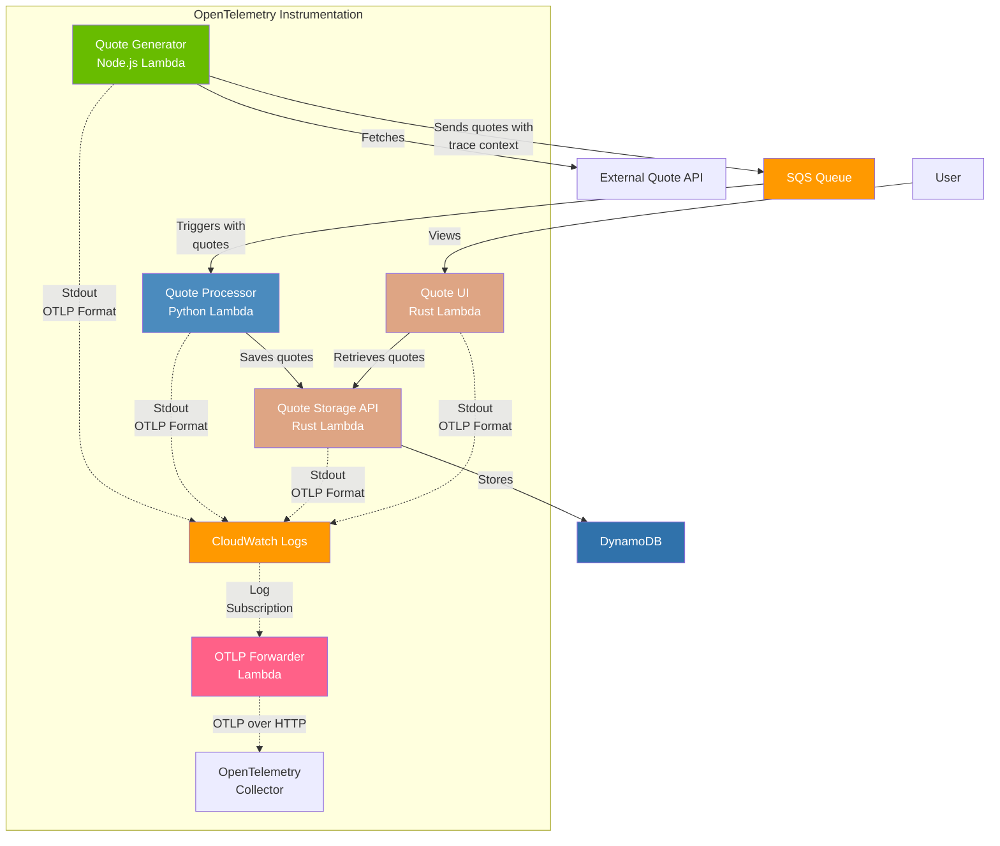

# Serverless OTLP Forwarder Demo

This demo showcases a distributed microservices application instrumented with OpenTelemetry using the Serverless OTLP Forwarder project. It demonstrates how to implement distributed tracing across multiple AWS Lambda functions in different programming languages while minimizing the performance impact typically associated with telemetry collection.

## Overview

The demo implements a quote processing system with these components:

1. **Quote Generator** (Node.js) - Fetches random quotes from an external API and sends them to SQS
2. **Quote Processor** (Python) - Processes SQS messages and saves quotes to the backend API
3. **Quote Storage API** (Rust) - Handles CRUD operations for quotes in DynamoDB
4. **Quote UI** (Rust) - Provides a web interface for viewing quotes

All components are instrumented with OpenTelemetry using the Lambda OTel Lite libraries, which are designed specifically for AWS Lambda environments.

## Architecture



### Data Flow

1. The Quote Generator function runs every 5 minutes and fetches random quotes from an external API
2. These quotes are sent to an SQS queue with trace context propagation
3. The Quote Processor function is triggered by messages in the SQS queue
4. It processes the quotes and forwards them to the Quote Storage API
5. The Quote Storage API stores the quotes in DynamoDB
6. The Quote UI provides a web interface for users to view the quotes

## Components

### Quote Generator (Node.js)

A scheduled Lambda function that:
- Runs every 5 minutes
- Fetches random quotes from an external API
- Sends quotes to an SQS queue with proper trace context propagation
- Uses `@dev7a/lambda-otel-lite` for efficient telemetry collection

### Quote Processor (Python)

An SQS-triggered Lambda function that:
- Processes quotes from the SQS queue
- Extracts trace context to maintain distributed tracing
- Forwards quotes to the Quote Storage API
- Uses `lambda_otel_lite` for OpenTelemetry instrumentation

### Quote Storage API (Rust)

A REST API Lambda function that:
- Provides endpoints for creating, retrieving, and listing quotes
- Stores quotes in DynamoDB
- Uses `lambda_otel_lite` crate for telemetry collection

### Quote UI (Rust)

A Lambda function that:
- Serves a web interface via Lambda Function URL
- Connects to the Quote Storage API to display quotes
- Uses `lambda_otel_lite` crate for telemetry collection

## Observability Features

This demo showcases several key observability features:

1. **Cross-Language Distributed Tracing** - Maintains trace context across service boundaries and different languages
2. **Efficient Telemetry Collection** - Uses the Lambda OTel Lite libraries to minimize performance impact
3. **Span Attributes and Events** - Rich contextual information added to spans for debugging
4. **Error Tracking** - Proper error handling with span recording
5. **OTLP Forwarding** - All telemetry data is exported using the serverless-otlp-forwarder architecture

## Deployment

### Prerequisites

Before deploying the demo application, ensure you have:

1. **AWS CLI** installed and configured with appropriate permissions
2. **AWS SAM CLI** installed (version 1.113.0 or higher)
3. **Rust** toolchain with `cargo-lambda` installed
   ```bash
   cargo install cargo-lambda
   ```
4. **Node.js** 20.x or higher
5. **Python** 3.12 or higher
6. The Serverless OTLP Forwarder core stack deployed in your AWS account

### Deployment Steps

1. Clone the repository (if you haven't already):
   ```bash
   git clone https://github.com/dev7a/serverless-otlp-forwarder.git
   cd serverless-otlp-forwarder/demo
   ```

2. Build and deploy the application using SAM:
   ```bash
   sam build
   sam deploy
   ```

### Verifying the Deployment

After successful deployment, SAM will output several URLs and ARNs. You can verify the deployment by:

1. Opening the Quote UI URL in your browser (provided in the CloudFormation outputs)
2. Waiting 5 minutes for the Quote Generator to run and populate some quotes
3. Checking CloudWatch Logs for each function to verify they're running correctly

Example verification using AWS CLI:
```bash
# Check Quote Generator logs
sam logs -n QuoteGeneratorFunction

# Check Quote Processor logs
sam logs -n QuoteProcessorFunction

# Check Quote Storage API logs
sam logs -n QuoteStorageAPIFunction
```

### Cleanup

While the demo uses fully serverless components that only incur charges during actual usage (and are very cost-effective even when active), you can delete the stack when you're done experimenting:
```bash
sam delete
```

This will remove all resources created by the demo application. Note that even if left running, the serverless architecture means:
- Lambda functions only cost when invoked
- DynamoDB uses pay-per-request pricing with no standing charges
- SQS has no base charges and includes a generous free tier
- API Gateway REST APIs have no standing charges and include a free tier of 1 million requests per month

## References

- [Serverless OTLP Forwarder Documentation](https://dev7a.github.io/serverless-otlp-forwarder/)
- [OpenTelemetry Documentation](https://opentelemetry.io/docs/)
- [AWS Lambda Developer Guide](https://docs.aws.amazon.com/lambda/latest/dg/welcome.html)