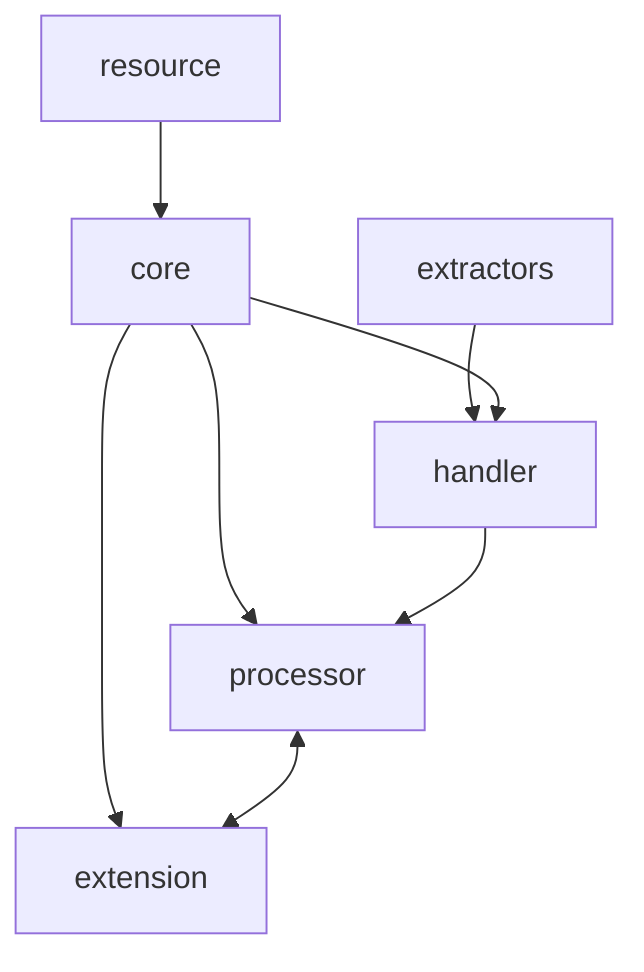
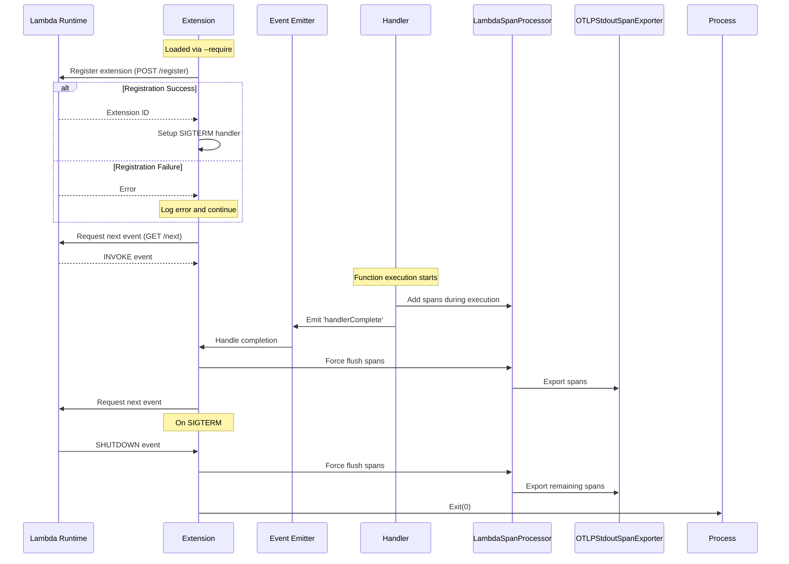

# Lambda OTel Lite

The `@dev7a/lambda-otel-lite` package provides a lightweight, efficient OpenTelemetry implementation specifically designed for AWS Lambda environments in Node.js. It features a custom span processor and internal extension mechanism that optimizes telemetry collection for Lambda's unique execution model.

By leveraging Lambda's execution lifecycle and providing multiple processing modes, this package enables efficient telemetry collection with minimal impact on function latency. By default, it uses the `@dev7a/otlp-stdout-span-exporter` to export spans to CloudWatch Logs, where they can be collected and forwarded by the [serverless-otlp-forwarder](https://github.com/dev7a/serverless-otlp-forwarder). It is also possible to use other standard exporters, such as the OTLP/gRPC exporter.

The serverless-otlp-forwarder is a companion project that:
- Collects OTLP-formatted spans from CloudWatch Logs
- Forwards them to your OpenTelemetry backend
- Supports multiple backends (Jaeger, Zipkin, etc.)
- Provides automatic batching and retry mechanisms

>[!IMPORTANT]
>This package is highly experimental and should not be used in production. Contributions are welcome.

## Features

- **Flexible Processing Modes**: Support for synchronous, asynchronous, and custom export strategies
- **Automatic Resource Detection**: Automatic extraction of Lambda environment attributes
- **Lambda Extension Integration**: Built-in extension for efficient telemetry export
- **AWS Event Support**: Automatic extraction of attributes from common AWS event types (API Gateway v1/v2, ALB)
- **Flexible Context Propagation**: Support for W3C Trace Context
- **TypeScript Support**: Full TypeScript type definitions included

## Architecture and Modules

The package follows a modular architecture where each component has a specific responsibility while working together efficiently:



- **Core**: Core initialization and configuration
  - Main entry point via `initTelemetry`
  - Configures global tracer and span processors
  - Returns a `TelemetryCompletionHandler` for span lifecycle management

- **Processor**: Lambda-optimized span processor
  - Configurable queue size implementation
  - Multiple processing modes
  - Coordinates with extension for async export

- **Extension**: Lambda Extension implementation
  - Manages extension lifecycle and registration
  - Handles span export coordination
  - Implements graceful shutdown

- **Resource**: Resource attribute management
  - Automatic Lambda attribute detection
  - Environment-based configuration
  - Custom attribute support

- **Extractors**: Event processing
  - Built-in support for API Gateway (v1/v2) and ALB events
  - Extensible interface for custom events
  - W3C Trace Context propagation

## Installation

Add the package to your project:
```bash
npm install --save @dev7a/lambda-otel-lite
```

## Processing Modes

The package supports three processing modes for span export:

1. **Sync Mode** (default):
   - Direct, synchronous export in handler thread
   - Recommended for low-volume telemetry or when latency is not critical
   - Set via `LAMBDA_EXTENSION_SPAN_PROCESSOR_MODE=sync`
   - Does not install a sigterm handler

2. **Async Mode**:
   - Export via Lambda extension using AWS Lambda Extensions API
   - Spans are queued and exported after handler completion
   - Best for production use with high telemetry volume
   - Set via `LAMBDA_EXTENSION_SPAN_PROCESSOR_MODE=async`
   - Requires extension initialization: `NODE_OPTIONS=--require @dev7a/lambda-otel-lite/extension`
   - Install a sigterm handler to ensure spans are flushed on shutdown

3. **Finalize Mode**:
   - Leaves span export to the processor implementation
   - Best for use with BatchSpanProcessor
   - Set via `LAMBDA_EXTENSION_SPAN_PROCESSOR_MODE=finalize`
   - Install a sigterm handler to ensure spans are flushed on shutdown

## Processing Modes Architecture

The async mode leverages Lambda's extension API to optimize perceived latency by deferring span export until after the response is sent to the user. The extension is loaded via Node.js's `--require` flag and uses an event-driven architecture:



Key aspects of the implementation:
1. The extension is loaded at startup via `--require` flag
2. Uses Node.js's built-in `http` module for Lambda API communication
3. Leverages event emitters for handler completion notification
4. Single event loop handles both extension and handler code
5. SIGTERM handler ensures graceful shutdown with span flushing

## Usage

### Basic Usage

```typescript
import { initTelemetry, tracedHandler } from '@dev7a/lambda-otel-lite';

// Initialize telemetry (do this once, outside the handler)
const completionHandler = initTelemetry('my-service');

export const handler = async (event: any, context: any) => {
  return tracedHandler({
    completionHandler,
    name: 'my-handler'
  }, event, context, async (span) => {
    // Your handler code here
    return {
      statusCode: 200,
      body: 'Success'
    };
  });
};
```

### Deployment Examples

For complete deployment examples using AWS SAM, including both standard Node.js and ESBuild bundling approaches, see the [examples directory](./examples/).

### With API Gateway Event Extraction

```typescript
import { initTelemetry, tracedHandler } from '@dev7a/lambda-otel-lite';
import { apiGatewayV2Extractor } from '@dev7a/lambda-otel-lite';

const completionHandler = initTelemetry('my-service');

export const handler = async (event: any, context: any) => {
  return tracedHandler({
    completionHandler,
    name: 'my-handler',
    attributesExtractor: apiGatewayV2Extractor
  }, event, context, async (span) => {
    // Your handler code here
    return {
      statusCode: 200,
      body: 'Success'
    };
  });
};
```

### Custom Resource Attributes

```typescript
import { initTelemetry, tracedHandler } from '@dev7a/lambda-otel-lite';
import { Resource } from '@opentelemetry/resources';

const resource = new Resource({
  'service.version': '1.0.0',
  'deployment.environment': 'production'
});

const completionHandler = initTelemetry('my-service', {
  resource
});

export const handler = async (event: any, context: any) => {
  // ... handler implementation
};
```

### Custom Span Processor

```typescript
import { initTelemetry } from '@dev7a/lambda-otel-lite';
import { BatchSpanProcessor } from '@opentelemetry/sdk-trace-base';
import { OTLPStdoutSpanExporter } from '@dev7a/otlp-stdout-span-exporter';

const processor = new BatchSpanProcessor(new OTLPStdoutSpanExporter());

const completionHandler = initTelemetry('my-service', {
  spanProcessors: [processor]
});
```

### Using Different Exporters and Processors

The package supports any OpenTelemetry-compatible exporter and processor. Here are some examples:

#### Console Exporter with Simple Processor
Good for development and debugging, outputs spans directly to console:

```typescript
import { initTelemetry } from '@dev7a/lambda-otel-lite';
import { ConsoleSpanExporter, SimpleSpanProcessor } from '@opentelemetry/sdk-trace-base';

const consoleExporter = new ConsoleSpanExporter();
const simpleProcessor = new SimpleSpanProcessor(consoleExporter);

const completionHandler = initTelemetry('my-service', {
  spanProcessors: [simpleProcessor]
});
```

#### OTLP/HTTP Exporter with Batch Processor
Suitable for production use with an OTLP-compatible backend:

```typescript
import { initTelemetry } from '@dev7a/lambda-otel-lite';
import { BatchSpanProcessor } from '@opentelemetry/sdk-trace-base';
import { OTLPTraceExporter } from '@opentelemetry/exporter-trace-otlp-http';

const otlpExporter = new OTLPTraceExporter({
  url: 'https://your-otlp-endpoint:4318/v1/traces'
});
const batchProcessor = new BatchSpanProcessor(otlpExporter);

const completionHandler = initTelemetry('my-service', {
  spanProcessors: [batchProcessor]
});
```

#### Multiple Processors
Useful for debugging while still sending spans to your production backend:

```typescript
import { initTelemetry } from '@dev7a/lambda-otel-lite';
import { ConsoleSpanExporter, SimpleSpanProcessor, BatchSpanProcessor } from '@opentelemetry/sdk-trace-base';
import { OTLPTraceExporter } from '@opentelemetry/exporter-trace-otlp-http';

const completionHandler = initTelemetry('my-service', {
  spanProcessors: [
    new SimpleSpanProcessor(new ConsoleSpanExporter()),
    new BatchSpanProcessor(new OTLPTraceExporter({
      url: 'https://your-otlp-endpoint:4318/v1/traces'
    }))
  ]
});
```

Note: When using processors other than the default `LambdaSpanProcessor`, make sure to:
1. Consider the processing mode (`sync`, `async`, `finalize`) that best fits your exporter
2. Ensure proper shutdown handling in your processor configuration
3. Be mindful of Lambda's execution time limits when using batch processors

### Creating Custom Event Extractors

You can create custom extractors for different event types by implementing the attribute extraction interface. This is useful when working with custom event sources or AWS services not covered by the built-in extractors.

```typescript
import { SpanKind } from '@opentelemetry/api';
import { TriggerType, SpanAttributes } from '@dev7a/lambda-otel-lite';
import { LambdaContext } from '@dev7a/lambda-otel-lite';

// Example: Custom extractor for SQS events
function sqsEventExtractor(event: any, context: LambdaContext): SpanAttributes {
  // Check if this is an SQS event
  if (!event?.Records?.[0]?.eventSource?.includes('aws:sqs')) {
    return {
      trigger: TriggerType.Other,
      kind: SpanKind.INTERNAL,
      attributes: {}
    };
  }

  const record = event.Records[0];
  
  return {
    // Mark as messaging trigger
    trigger: TriggerType.PubSub,
    // Use CONSUMER kind for message processing
    kind: SpanKind.CONSUMER,
    // Set span name to include queue name
    spanName: `process ${record.eventSourceARN.split(':').pop()}`,
    // Extract tracing headers from message attributes if present
    carrier: record.messageAttributes?.['traceparent']?.stringValue 
      ? { traceparent: record.messageAttributes['traceparent'].stringValue }
      : undefined,
    // Add relevant attributes following semantic conventions
    attributes: {
      'messaging.system': 'aws.sqs',
      'messaging.destination': record.eventSourceARN,
      'messaging.destination_kind': 'queue',
      'messaging.operation': 'process',
      'messaging.message_id': record.messageId,
      'aws.sqs.message_group_id': record.attributes.MessageGroupId,
      'aws.sqs.message_deduplication_id': record.attributes.MessageDeduplicationId,
    }
  };
}

// Example: Custom HTTP Framework Extractor
function customHttpExtractor(event: any, context: LambdaContext): SpanAttributes {
  if (!event?.method) {
    return {
      trigger: TriggerType.Other,
      kind: SpanKind.INTERNAL,
      attributes: {}
    };
  }

  const path = event.path || '/';
  
  return {
    trigger: TriggerType.Http,
    kind: SpanKind.SERVER,
    // Set span name to HTTP method and path
    spanName: `${event.method} ${path}`,
    // Extract standard HTTP headers for context propagation
    carrier: event.headers || {},
    attributes: {
      'http.method': event.method,
      'http.route': event.route,
      'http.target': path,
      'http.user_agent': event.headers?.['user-agent'],
      'http.request_content_length': event.headers?.['content-length'],
      'http.scheme': 'https',
      'http.flavor': event.protocol || '1.1',
    }
  };
}

// Usage with traced handler
export const handler = async (event: any, context: any) => {
  return tracedHandler({
    completionHandler,
    name: 'sqs-handler',
    attributesExtractor: sqsEventExtractor
  }, event, context, async (span) => {
    // Process SQS message
    return {
      statusCode: 200
    };
  });
};
```

#### Best Practices for Custom Extractors

1. **Type Safety**: Use TypeScript interfaces to ensure type safety for your event structures.
2. **Semantic Conventions**: Follow [OpenTelemetry semantic conventions](https://opentelemetry.io/docs/specs/semconv/) for attribute naming.
3. **Defensive Programming**: Always check for the existence of properties before accessing them.
4. **Context Propagation**: If the event source supports headers or attributes, extract tracing context when available.
5. **Span Kind**: Choose the appropriate `SpanKind` based on the operation type:
   - `SERVER` for HTTP requests
   - `CONSUMER` for message processing
   - `CLIENT` for outgoing calls
   - `PRODUCER` for message publishing
   - `INTERNAL` for internal operations

## Configuration

### Environment Variables

- `LAMBDA_EXTENSION_SPAN_PROCESSOR_MODE`: Processing mode (`sync`, `async`, or `finalize`)
- `LAMBDA_SPAN_PROCESSOR_QUEUE_SIZE`: Maximum number of spans to queue (default: 2048)
- `LAMBDA_SPAN_PROCESSOR_BATCH_SIZE`: Maximum batch size for export (default: 512)
- `OTLP_STDOUT_SPAN_EXPORTER_COMPRESSION_LEVEL`: GZIP compression level for span export (default: 6)
- `OTEL_SERVICE_NAME`: Service name (defaults to Lambda function name)
- `OTEL_RESOURCE_ATTRIBUTES`: Additional resource attributes in key=value format

For configuration of the OTLP forwarder, see the [serverless-otlp-forwarder documentation](https://github.com/dev7a/serverless-otlp-forwarder).

## License

[MIT License](LICENSE)