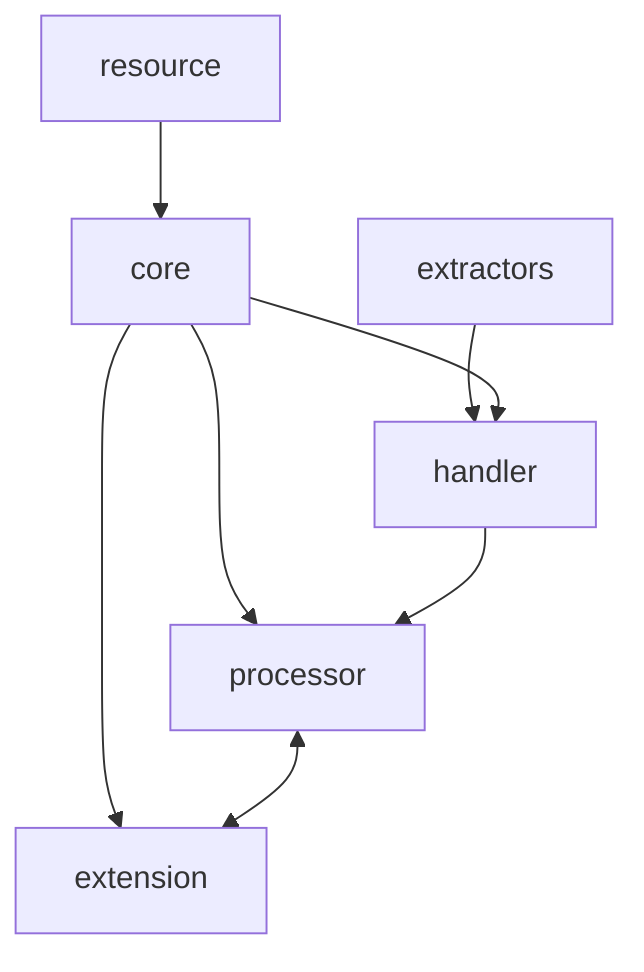
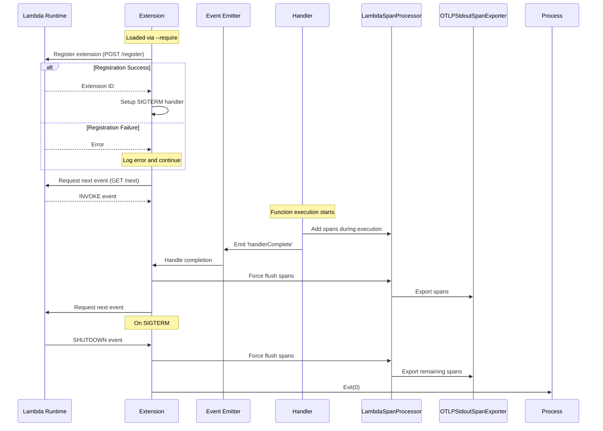

# Lambda OTel Lite

The `@dev7a/lambda-otel-lite` package provides a lightweight, efficient OpenTelemetry implementation specifically designed for AWS Lambda environments in Node.js. It features a custom span processor and internal extension mechanism that optimizes telemetry collection for Lambda's unique execution model.

By leveraging Lambda's execution lifecycle and providing multiple processing modes, this package enables efficient telemetry collection with minimal impact on function latency. By default, it uses the `@dev7a/otlp-stdout-span-exporter` to export spans to CloudWatch Logs, where they can be collected and forwarded by the [serverless-otlp-forwarder](https://github.com/dev7a/serverless-otlp-forwarder).

>[!IMPORTANT]
>This package is highly experimental and should not be used in production. Contributions are welcome.

## Features

- **Flexible Processing Modes**: Support for synchronous, asynchronous, and custom export strategies
- **Automatic Resource Detection**: Automatic extraction of Lambda environment attributes
- **Lambda Extension Integration**: Built-in extension for efficient telemetry export
- **AWS Event Support**: Automatic extraction of attributes from common AWS event types (API Gateway v1/v2, ALB)
- **Flexible Context Propagation**: Support for W3C Trace Context
- **TypeScript Support**: Full TypeScript type definitions included

## Architecture and Modules

The package follows a modular architecture where each component has a specific responsibility while working together efficiently:



- **Core**: Core initialization and configuration
  - Main entry point via `initTelemetry`
  - Configures global tracer and span processors
  - Returns a `TelemetryCompletionHandler` for span lifecycle management

- **Processor**: Lambda-optimized span processor
  - Configurable queue size implementation
  - Multiple processing modes
  - Coordinates with extension for async export

- **Extension**: Lambda Extension implementation
  - Manages extension lifecycle and registration
  - Handles span export coordination
  - Implements graceful shutdown

- **Resource**: Resource attribute management
  - Automatic Lambda attribute detection
  - Environment-based configuration
  - Custom attribute support

- **Extractors**: Event processing
  - Built-in support for API Gateway (v1/v2) and ALB events
  - Extensible interface for custom events
  - W3C Trace Context propagation

## Installation

Add the package to your project:
```bash
npm install --save @dev7a/lambda-otel-lite
```

## Processing Modes

The package supports three processing modes for span export:

1. **Sync Mode** (default):
   - Direct, synchronous export in handler thread
   - Recommended for low-volume telemetry or when latency is not critical
   - Set via `LAMBDA_EXTENSION_SPAN_PROCESSOR_MODE=sync`
   - Does not install a sigterm handler

2. **Async Mode**:
   - Export via Lambda extension using AWS Lambda Extensions API
   - Spans are queued and exported after handler completion
   - Best for production use with high telemetry volume
   - Set via `LAMBDA_EXTENSION_SPAN_PROCESSOR_MODE=async`
   - Requires extension initialization: `NODE_OPTIONS=--require @dev7a/lambda-otel-lite/extension`
   - Install a sigterm handler to ensure spans are flushed on shutdown

3. **Finalize Mode**:
   - Leaves span export to the processor implementation
   - Best for use with BatchSpanProcessor
   - Set via `LAMBDA_EXTENSION_SPAN_PROCESSOR_MODE=finalize`
   - Install a sigterm handler to ensure spans are flushed on shutdown

## Processing Modes Architecture

The async mode leverages Lambda's extension API to optimize perceived latency by deferring span export until after the response is sent to the user. The extension is loaded via Node.js's `--require` flag and uses an event-driven architecture:



Key aspects of the implementation:
1. The extension is loaded at startup via `--require` flag
2. Uses Node.js's built-in `http` module for Lambda API communication
3. Leverages event emitters for handler completion notification
4. Single event loop handles both extension and handler code
5. SIGTERM handler ensures graceful shutdown with span flushing

## Configuration
### Environment Variables

- `LAMBDA_EXTENSION_SPAN_PROCESSOR_MODE`: Processing mode (`sync`, `async`, or `finalize`)
- `LAMBDA_SPAN_PROCESSOR_QUEUE_SIZE`: Maximum number of spans to queue (default: 2048)
- `LAMBDA_SPAN_PROCESSOR_BATCH_SIZE`: Maximum batch size for export (default: 512)
- `OTLP_STDOUT_SPAN_EXPORTER_COMPRESSION_LEVEL`: GZIP compression level for span export (default: 6)
- `OTEL_SERVICE_NAME`: Service name (defaults to Lambda function name)
- `OTEL_RESOURCE_ATTRIBUTES`: Additional resource attributes in key=value format

## Automatic Attributes extraction

The library automatically sets relevant FAAS attributes based on the Lambda context and event. Both `event` and `context` parameters must be passed to `tracedHandler` to enable all automatic attributes:

- Resource Attributes (set at initialization):
  - `cloud.provider`: "aws"
  - `cloud.region`: from AWS_REGION
  - `faas.name`: from AWS_LAMBDA_FUNCTION_NAME
  - `faas.version`: from AWS_LAMBDA_FUNCTION_VERSION
  - `faas.instance`: from AWS_LAMBDA_LOG_STREAM_NAME
  - `faas.max_memory`: from AWS_LAMBDA_FUNCTION_MEMORY_SIZE
  - `service.name`: from OTEL_SERVICE_NAME (defaults to function name)
  - Additional attributes from OTEL_RESOURCE_ATTRIBUTES (URL-decoded)

- Span Attributes (set per invocation when passing context):
  - `faas.cold_start`: true on first invocation
  - `cloud.account.id`: extracted from context's invokedFunctionArn
  - `faas.invocation_id`: from awsRequestId
  - `cloud.resource_id`: from context's invokedFunctionArn

- HTTP Attributes (set for API Gateway events):
  - `faas.trigger`: "http"
  - `http.status_code`: from handler response
  - `http.route`: from routeKey (v2) or resource (v1)
  - `http.method`: from requestContext (v2) or httpMethod (v1)
  - `http.target`: from path
  - `http.scheme`: from protocol

The library automatically detects API Gateway v1 and v2 events and sets the appropriate HTTP attributes. For HTTP responses, the status code is automatically extracted from the handler's response and set as `http.status_code`. For 5xx responses, the span status is set to ERROR.

### Library specific Resource Attributes

The package adds several resource attributes under the `lambda_otel_lite` namespace to provide configuration visibility:

- `lambda_otel_lite.extension.span_processor_mode`: Current processing mode (`sync`, `async`, or `finalize`)
- `lambda_otel_lite.lambda_span_processor.queue_size`: Maximum number of spans that can be queued
- `lambda_otel_lite.lambda_span_processor.batch_size`: Maximum batch size for span export
- `lambda_otel_lite.otlp_stdout_span_exporter.compression_level`: GZIP compression level used for span export

These attributes are automatically added to the resource and can be used to understand the telemetry configuration in your observability backend.

## Usage

### Basic Usage

The package provides a simple API for instrumenting AWS Lambda functions with OpenTelemetry:

```typescript
import { createTracedHandler, initTelemetry } from '@dev7a/lambda-otel-lite';
import { apiGatewayV2Extractor } from '@dev7a/lambda-otel-lite/extractors';

// Initialize telemetry with default configuration
const { tracer, completionHandler } = initTelemetry();

// Create a traced handler with a name and optional attribute extractor
const handler = createTracedHandler(completionHandler, {
  name: 'my-handler',
  attributesExtractor: apiGatewayV2Extractor
});

// Use the traced handler to process Lambda events
export const lambdaHandler = handler(async (event, context, span) => {
  // Add custom attributes to the handler's span
  span.setAttribute('custom.attribute', 'value');
  
  // Create a child span for a sub-operation
  return tracer.startActiveSpan('process_request', span => {
    span.setAttribute('operation.type', 'process');
    // ... do some work ...
    span.end();
    return {
      statusCode: 200,
      body: JSON.stringify({ message: 'Hello World' })
    };
  });
});
```

### Event Extractors

The package also provides a set of extractors for common AWS Lambda triggers:

```typescript
import { createTracedHandler, initTelemetry } from '@dev7a/lambda-otel-lite';
import {
  apiGatewayV1Extractor,
  apiGatewayV2Extractor,
  snsExtractor,
  sqsExtractor,
  s3Extractor,
  eventBridgeExtractor
} from '@dev7a/lambda-otel-lite/extractors';

// Initialize telemetry with default configuration
const { tracer, completionHandler } = initTelemetry();

// Create a traced handler for API Gateway v2 events
const handler = createTracedHandler(completionHandler, {
  name: 'api-handler',
  attributesExtractor: apiGatewayV2Extractor
});

// Use the traced handler to process Lambda events
export const lambdaHandler = handler(async (event, context, span) => {
  // Create a child span for request processing
  return tracer.startActiveSpan('process_request', span => {
    // ... process the request ...
    span.end();
    return {
      statusCode: 200,
      body: JSON.stringify({ message: 'Hello World' })
    };
  });
});
```

### Custom Resource Attributes

```typescript
import { createTracedHandler, initTelemetry } from '@dev7a/lambda-otel-lite';
import { Resource } from '@opentelemetry/resources';

const resource = new Resource({
  'service.version': '1.0.0',
  'deployment.environment': 'production'
});

const { tracer, completionHandler } = initTelemetry({
  resource
});

const handler = createTracedHandler(completionHandler, {
  name: 'my-handler'
});

export const lambdaHandler = handler(async (event, context, span) => {
  // Create a child span for request processing
  return tracer.startActiveSpan('process_request', span => {
    // ... process the request ...
    span.end();
    return {
      statusCode: 200,
      body: JSON.stringify({ message: 'Hello World' })
    };
  });
});
```

### Custom Span Processor

```typescript
import { createTracedHandler, initTelemetry } from '@dev7a/lambda-otel-lite';
import { BatchSpanProcessor } from '@opentelemetry/sdk-trace-base';
import { ConsoleSpanExporter } from '@opentelemetry/sdk-trace-base';

const processor = new BatchSpanProcessor(new ConsoleSpanExporter());

const { tracer, completionHandler } = initTelemetry({
  spanProcessors: [processor]
});

const handler = createTracedHandler(completionHandler, {
  name: 'my-handler'
});

export const lambdaHandler = handler(async (event, context, span) => {
  // Create a child span for request processing
  return tracer.startActiveSpan('process_request', span => {
    // ... process the request ...
    span.end();
    return {
      statusCode: 200,
      body: JSON.stringify({ message: 'Hello World' })
    };
  });
});
```

### Creating Custom Event Extractors

You can create custom extractors for different event types by implementing the attribute extraction interface. This is useful when working with custom event sources or AWS services not covered by the built-in extractors.

```typescript
import { SpanKind } from '@opentelemetry/api';
import { TriggerType, SpanAttributes } from '@dev7a/lambda-otel-lite';
import { LambdaContext } from '@dev7a/lambda-otel-lite';

// Example: Custom extractor for SQS events
function sqsEventExtractor(event: any, context: LambdaContext): SpanAttributes {
  // Check if this is an SQS event
  if (!event?.Records?.[0]?.eventSource?.includes('aws:sqs')) {
    return {
      trigger: TriggerType.Other,
      kind: SpanKind.INTERNAL,
      attributes: {}
    };
  }

  const record = event.Records[0];
  
  return {
    trigger: TriggerType.PubSub,
    kind: SpanKind.CONSUMER,
    spanName: `process ${record.eventSourceARN.split(':').pop()}`,
    carrier: record.messageAttributes?.['traceparent']?.stringValue 
      ? { traceparent: record.messageAttributes['traceparent'].stringValue }
      : undefined,
    attributes: {
      'messaging.system': 'aws.sqs',
      'messaging.destination': record.eventSourceARN,
      'messaging.destination_kind': 'queue',
      'messaging.operation': 'process',
      'messaging.message_id': record.messageId,
      'aws.sqs.message_group_id': record.attributes.MessageGroupId,
      'aws.sqs.message_deduplication_id': record.attributes.MessageDeduplicationId,
    }
  };
}

const { tracer, completionHandler } = initTelemetry();

const handler = createTracedHandler(completionHandler, {
  name: 'sqs-handler',
  attributesExtractor: sqsEventExtractor
});

export const lambdaHandler = handler(async (event, context, span) => {
  // Create a child span for message processing
  return tracer.startActiveSpan('process_message', span => {
    // ... process SQS message ...
    span.end();
    return {
      statusCode: 200
    };
  });
});
```

## License

[MIT License](LICENSE)