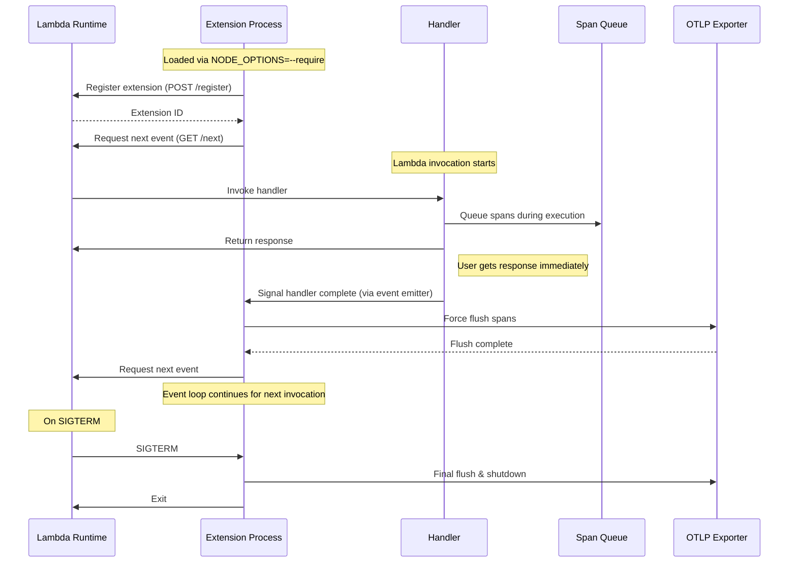

# @dev7a/lambda-otel-lite

The `lambda-otel-lite` library provides a lightweight, efficient OpenTelemetry implementation specifically designed for AWS Lambda environments. It features a custom span processor and internal extension mechanism that optimizes telemetry collection for Lambda's unique execution model.

By leveraging Lambda's execution lifecycle and providing multiple processing modes, this library enables efficient telemetry collection with minimal impact on function latency. By default, it uses the [@dev7a/otlp-stdout-span-exporter](https://www.npmjs.com/package/@dev7a/otlp-stdout-span-exporter) to export spans to stdout for the [serverless-otlp-forwarder](https://github.com/dev7a/serverless-otlp-forwarder) project.


>[!IMPORTANT]
>This package is highly experimental and should not be used in production. Contributions are welcome.

## Features

- Lambda-optimized span processor with queue-based buffering
- Three processing modes for different use cases:
  - Synchronous: Immediate span export
  - Asynchronous: Background processing via internal extension
  - Finalize: Compatible with standard BatchSpanProcessor
- Internal extension event loop for asynchronous mode
- Sigterm handler for asynchronous and finalize mode
- Automatic Lambda resource detection
- Automatic FAAS attributes from Lambda context and events (HTTP only)
- Cold start detection and tracking
- Configurable through environment variables
- Optimized for cold start performance

## Installation

You can install the `lambda-otel-lite` package using npm:

```bash
npm install @dev7a/lambda-otel-lite
```

## Usage

### Basic Usage

```javascript
const { SpanKind } = require('@opentelemetry/api');
const { initTelemetry, tracedHandler } = require('@dev7a/lambda-otel-lite');

// Initialize telemetry once at module load
const { tracer, provider } = initTelemetry('my-service');

exports.handler = async (event, context) => {
    return tracedHandler(
        {
            tracer,
            provider,
            name: 'my-handler',
            kind: SpanKind.SERVER,
            event,  // Optional: Enables automatic FAAS attributes from event
            context,  // Optional: Enables automatic FAAS attributes from context
        },
        async (span) => {
            // Your handler code here
            await processEvent(event);
            return { statusCode: 200 };
        }
    );
};

async function processEvent(event) {
    return tracer.startActiveSpan('process_event', async (span) => {
        span.setAttribute('event.type', event.type);
        // Process the event
        span.end();
    });
}

```

### Automatic FAAS Attributes

The library automatically sets relevant FAAS attributes based on the Lambda context and event. Both `event` and `context` parameters must be passed to `tracedHandler` to enable all automatic attributes:

- Resource Attributes (set at initialization):
  - `cloud.provider`: "aws"
  - `cloud.region`: from AWS_REGION
  - `faas.name`: from AWS_LAMBDA_FUNCTION_NAME
  - `faas.version`: from AWS_LAMBDA_FUNCTION_VERSION
  - `faas.instance`: from AWS_LAMBDA_LOG_STREAM_NAME
  - `faas.max_memory`: from AWS_LAMBDA_FUNCTION_MEMORY_SIZE
  - `service.name`: from OTEL_SERVICE_NAME (defaults to function name)
  - Additional attributes from OTEL_RESOURCE_ATTRIBUTES (URL-decoded)

- Span Attributes (set per invocation when passing context):
  - `faas.cold_start`: true on first invocation
  - `cloud.account.id`: extracted from context's invokedFunctionArn
  - `faas.invocation_id`: from awsRequestId
  - `cloud.resource_id`: from context's invokedFunctionArn

- HTTP Attributes (set for API Gateway events):
  - `faas.trigger`: "http"
  - `http.status_code`: from handler response
  - `http.route`: from routeKey (v2) or resource (v1)
  - `http.method`: from requestContext (v2) or httpMethod (v1)
  - `http.target`: from path
  - `http.scheme`: from protocol

The library automatically detects API Gateway v1 and v2 events and sets the appropriate HTTP attributes. For HTTP responses, the status code is automatically extracted from the handler's response and set as `http.status_code`. For 5xx responses, the span status is set to ERROR.

### Distributed Tracing

The library supports distributed tracing across service boundaries. Context propagation is handled automatically when you pass the `event` parameter and it contains a `headers` property. You can also provide a custom carrier extraction function for more complex scenarios:

```javascript
const { SpanKind } = require('@opentelemetry/api');
const { initTelemetry, tracedHandler } = require('@dev7a/lambda-otel-lite');

// Initialize telemetry once at module load
const { tracer, provider } = initTelemetry('my-service');

exports.handler = async (event, context) => {
    // Context propagation is handled automatically if event has 'headers'
    return tracedHandler(
        {
            tracer,
            provider,
            name: 'my-handler',
            kind: SpanKind.SERVER,
            event,  // Will automatically extract context from event.headers if present
            context,
            attributes: { 'custom.attribute': 'value' }
        },
        async (span) => {
            // Your handler code here
            return { statusCode: 200 };
        }
    );
};

// For custom carrier extraction:
function extractFromSQS(event) {
    // Extract tracing headers from the first record's message attributes
    if (event.Records && event.Records[0] && event.Records[0].messageAttributes) {
        return event.Records[0].messageAttributes;
    }
    return {};
}

exports.handlerWithCustomExtraction = async (event, context) => {
    return tracedHandler(
        {
            tracer,
            provider,
            name: 'my-handler',
            kind: SpanKind.SERVER,
            event,
            context,
            getCarrier: extractFromSQS  // Custom function to extract carrier from event
        },
        async (span) => {
            // Your handler code here
            return { statusCode: 200 };
        }
    );
};
```

Please note that in a real world scenario, for SQS events you should probably use span links instead.

### Custom Telemetry Configuration

You can customize the telemetry setup by providing your own span processors and chaining them:

```javascript
const { initTelemetry, tracedHandler } = require('@dev7a/lambda-otel-lite');
const { BatchSpanProcessor, NoopSpanProcessor, ConsoleSpanExporter } = require('@opentelemetry/sdk-trace-base');

// Simple processor example
class SimpleProcessor extends NoopSpanProcessor {
    onStart(span) {
        span.setAttribute('example.timestamp', Date.now());
    }
}

// Initialize with custom processor and exporter
const { tracer, provider } = initTelemetry('my-lambda-function', {
    spanProcessors: [
        new SimpleProcessor(),         // First add attributes
        new BatchSpanProcessor(        // Then export spans
            new ConsoleSpanExporter()
        )
    ]
});
```
If no processors are provided, the library defaults to using a `LambdaSpanProcessor` with `OTLPStdoutSpanExporter` for integration with the serverless-otlp-forwarder.

## Processing Modes

The library supports three processing modes, controlled by the `LAMBDA_EXTENSION_SPAN_PROCESSOR_MODE` environment variable:

1. **Synchronous Mode** (`sync`, default)
   - Spans are exported immediately in the handler thread
   - Best for development and debugging
   - Highest latency but immediate span visibility
   - Does not install the internal extension thread and the sigterm handler
   - Recommended for lower memory configurations (< 256MB)

2. **Asynchronous Mode** (`async`)
   - Spans are queued and processed by the internal extension thread
   - Export occurs after handler completion
   - Best for production use with higher memory configurations (>= 256MB)
   - Minimal impact on handler latency at higher memory configurations
   - Install the sigterm handler to flush remaining spans on termination
   - **Important**: Requires setting `NODE_OPTIONS=--require @dev7a/lambda-otel-lite/extension` to load the extension thread

3. **Finalize Mode** (`finalize`)
   - Install only the sigterm handler to flush remaining spans on termination
   - Typically used with the BatchSpanProcessor from the OpenTelemetry SDK for periodic flushes

### Async Mode Architecture

The async mode leverages Lambda's extension API to optimize perceived latency by deferring span export until after the response is sent to the user. Here's how it works:



#### Performance Considerations

While async mode can improve perceived latency by deferring span export, there are important performance considerations:

- **Memory Impact**: The coordination between the handler and extension process adds overhead. For functions with low memory configurations (< 256MB), this overhead might actually increase overall latency. In such cases, sync mode is recommended.

- **Cold Starts**: The extension initialization adds a small overhead to cold starts. This is usually negligible but should be considered for latency-sensitive applications.

- **Resource Usage**: Async mode requires additional resources for the extension process. This is generally not an issue with higher memory configurations (>= 256MB) but can impact performance on constrained environments.

For optimal performance:
- Use sync mode for functions with < 256MB memory
- Use async mode for functions with >= 256MB memory where perceived latency is critical
- Monitor and adjust based on your specific workload and requirements

## Environment Variables

The library can be configured using the following environment variables:

- `LAMBDA_EXTENSION_SPAN_PROCESSOR_MODE`: Processing mode (`sync`, `async`, or `finalize`)
- `LAMBDA_SPAN_PROCESSOR_QUEUE_SIZE`: Maximum number of spans to queue (default: 2048)
- `NODE_OPTIONS`: Must be set to `--require @dev7a/lambda-otel-lite/extension` when using async mode
- `OTEL_SERVICE_NAME`: Override the service name (defaults to function name)
- `OTEL_RESOURCE_ATTRIBUTES`: Additional resource attributes in key=value,key2=value2 format (URL-decoded values supported)
- `OTLP_STDOUT_SPAN_EXPORTER_COMPRESSION_LEVEL`: Gzip compression level for stdout exporter (0-9, default: 6)
  - 0: No compression
  - 1: Best speed
  - 6: Good balance between size and speed (default)
  - 9: Best compression


## SAM Template Examples

The following examples show how to configure your SAM template when using the `async` processing mode. For `sync` mode (default), no special configuration is needed.

### With esbuild

When using esbuild with async mode, you need to create a separate `init.js` file that will be bundled with your function:

```javascript
// init.js
require('@dev7a/lambda-otel-lite/extension');
```

```yaml
# template.yaml
MyFunction:
  Type: AWS::Serverless::Function
  Metadata:
    BuildMethod: esbuild
    BuildProperties:
      Minify: false
      Target: "es2022"
      Format: "cjs"
      Platform: "node"
      EntryPoints: 
        - 'index.js'
        - 'init.js'  # Required for async mode
  Properties:
    FunctionName: !Sub '${AWS::StackName}-my-function'
    CodeUri: ./
    Handler: index.handler
    Runtime: nodejs20.x
    Environment:
      Variables:
        OTEL_SERVICE_NAME: !Sub '${AWS::StackName}-my-function'
        LAMBDA_EXTENSION_SPAN_PROCESSOR_MODE: async  # Enable async mode
        NODE_OPTIONS: --require /var/task/init.js    # Load the extension
```

### Without esbuild

When not using esbuild but still wanting async mode, you can require the extension directly:

```yaml
# template.yaml
MyFunction:
  Type: AWS::Serverless::Function
  Properties:
    FunctionName: !Sub '${AWS::StackName}-my-function'
    CodeUri: ./
    Handler: index.handler
    Runtime: nodejs20.x
    Environment:
      Variables:
        OTEL_SERVICE_NAME: !Sub '${AWS::StackName}-my-function'
        LAMBDA_EXTENSION_SPAN_PROCESSOR_MODE: async  # Enable async mode
        NODE_OPTIONS: --require @dev7a/lambda-otel-lite/extension  # Load the extension
```

## License

This project is licensed under the MIT License - see the [LICENSE](LICENSE) file for details. 