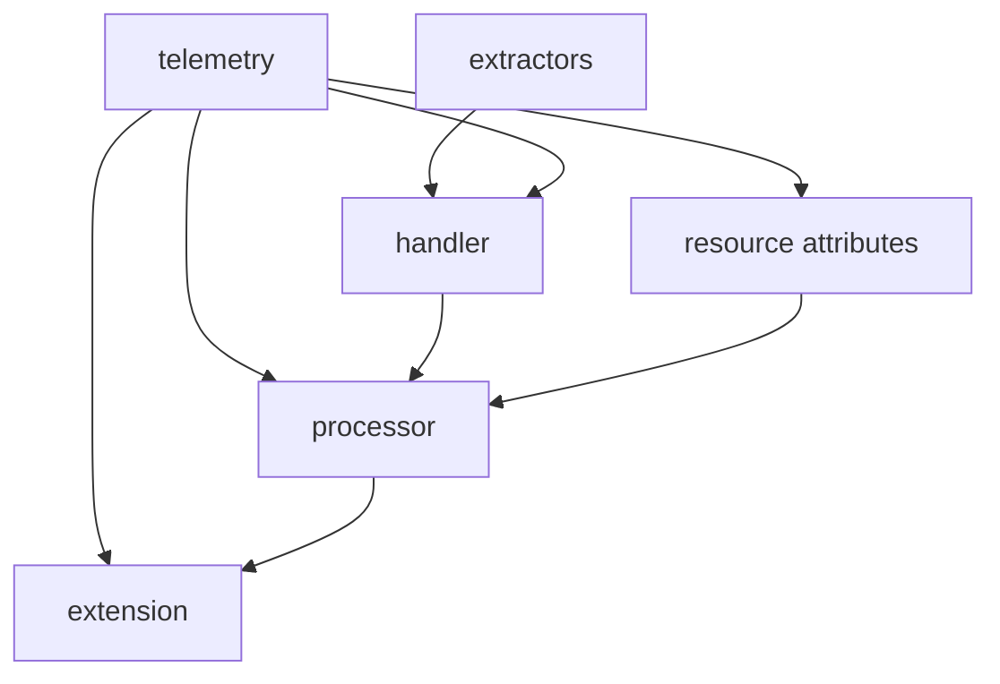
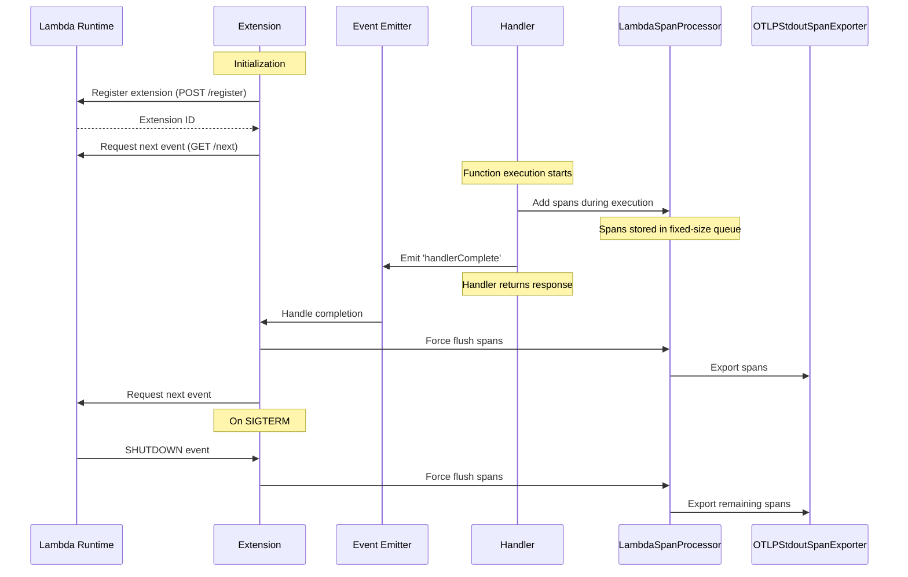

# Lambda OTel Lite

The `@dev7a/lambda-otel-lite` package provides a lightweight, efficient OpenTelemetry implementation specifically designed for AWS Lambda environments in Node.js. It features a custom span processor and internal extension mechanism that optimizes telemetry collection for Lambda's unique execution model.

By leveraging Lambda's execution lifecycle and providing multiple processing modes, this package enables efficient telemetry collection with minimal impact on function latency. By default, it uses the `@dev7a/otlp-stdout-span-exporter` to export spans to CloudWatch Logs, where they can be collected and forwarded by the [serverless-otlp-forwarder](https://github.com/dev7a/serverless-otlp-forwarder).

>[!IMPORTANT]
>This package is highly experimental and should not be used in production. Contributions are welcome.

## Requirements
- Node.js >= 18.0.0

## Features

- **Flexible Processing Modes**: Support for synchronous, asynchronous, and custom export strategies
- **Automatic Resource Detection**: Automatic extraction of Lambda environment attributes
- **Lambda Extension Integration**: Built-in extension for efficient telemetry export
- **Efficient Memory Usage**: Queue-based buffering to prevent memory growth
- **AWS Event Support**: Automatic extraction of attributes from common AWS event types (API Gateway v1/v2, ALB)
- **Flexible Context Propagation**: Support for W3C Trace Context
- **TypeScript Support**: Full TypeScript type definitions included

## Architecture and Modules

The package follows a modular architecture where each component has a specific responsibility while working together efficiently:



- `telemetry`: Core initialization and configuration
  - Main entry point via `initTelemetry`
  - Configures global tracer and span processors
  - Returns a `TelemetryCompletionHandler` for span lifecycle management

- `processor`: Lambda-optimized span processor
  - Queue-based implementation
  - Multiple processing modes
  - Coordinates with extension for async export

- `extension`: Lambda Extension implementation
  - Manages extension lifecycle and registration
  - Handles span export coordination
  - Implements graceful shutdown

- `extractors`: Event processing
  - Built-in support for API Gateway and ALB events
  - Extensible interface for custom events
  - W3C Trace Context propagation

## Installation

```bash
# Install the base package
npm install --save @dev7a/lambda-otel-lite

# Optional: For OTLP HTTP export support
npm install --save @opentelemetry/exporter-trace-otlp-http
```

## Quick Start

```typescript
import { trace } from '@opentelemetry/api';
import { initTelemetry, createTracedHandler } from '@dev7a/lambda-otel-lite';
import { apiGatewayV2Extractor } from '@dev7a/lambda-otel-lite/extractors';

// Initialize telemetry once, outside the handler
const { tracer, completionHandler } = initTelemetry();

// Create traced handler with configuration
const traced = createTracedHandler(
    'my-handler',
    completionHandler,
    apiGatewayV2Extractor  // Optional: Use event-specific extractor
);

function processEvent(event: any) {
    // Your business logic here
    return {
        statusCode: 200,
        body: JSON.stringify({ message: "Success" })
    };
}

export const handler = traced(async (event, context) => {
    // Access current span via OpenTelemetry API
    const currentSpan = trace.getActiveSpan();
    currentSpan?.setAttribute("custom", "value");
    
    // Your handler code here
    const result = await processEvent(event);
    return result;
});
```

## Processing Modes

The package supports three processing modes for span export:

1. **Sync Mode** (default):
   - Direct, synchronous export in handler thread
   - Recommended for low-volume telemetry or when latency is not critical
   - Set via `LAMBDA_EXTENSION_SPAN_PROCESSOR_MODE=sync`

2. **Async Mode**:
   - Export via Lambda extension using AWS Lambda Extensions API
   - Spans are queued and exported after handler completion
   - Uses event-based communication between handler and extension
   - Registers specifically for Lambda INVOKE events
   - Implements graceful shutdown with SIGTERM handling
   - Error handling for:
     - Event communication failures
     - Export failures
     - Extension registration issues
   - Best for production use with high telemetry volume
   - Set via `LAMBDA_EXTENSION_SPAN_PROCESSOR_MODE=async`
   - Requires extension initialization: `NODE_OPTIONS=--require @dev7a/lambda-otel-lite/extension`

3. **Finalize Mode**:
   - Registers extension with no events
   - Maintains SIGTERM handler for graceful shutdown
   - Ensures all spans are flushed during shutdown
   - Compatible with BatchSpanProcessor for custom export strategies
   - Best for specialized export requirements where you need full control
   - Set via `LAMBDA_EXTENSION_SPAN_PROCESSOR_MODE=finalize`

### Async Processing Mode Architecture



The async mode leverages Lambda's extension API to optimize perceived latency by deferring span export until after the response is sent to the user. The extension is loaded via Node.js's `--require` flag and uses an event-driven architecture:

1. The extension is loaded at startup via `--require` flag
2. Uses Node.js's built-in `http` module for Lambda API communication
3. Leverages event emitters for handler completion notification
4. Single event loop handles both extension and handler code
5. SIGTERM handler ensures graceful shutdown with span flushing

## Environment Variables

The package can be configured using the following environment variables:

### Processing Configuration
- `LAMBDA_EXTENSION_SPAN_PROCESSOR_MODE`: Controls span processing strategy
  - `sync`: Direct export in handler thread (default)
  - `async`: Deferred export via extension
  - `finalize`: Custom export strategy
- `LAMBDA_SPAN_PROCESSOR_QUEUE_SIZE`: Maximum number of spans to queue (default: 2048)
- `LAMBDA_SPAN_PROCESSOR_BATCH_SIZE`: Maximum number of spans to export in each batch (default: 512)

### Resource Configuration
- `OTEL_SERVICE_NAME`: Override the service name (defaults to function name)
- `OTEL_RESOURCE_ATTRIBUTES`: Additional resource attributes in key=value,key2=value2 format

### Export Configuration
- `OTLP_STDOUT_SPAN_EXPORTER_COMPRESSION_LEVEL`: Gzip compression level for stdout exporter
  - 0: No compression
  - 1: Best speed
  - 6: Good balance between size and speed (default)
  - 9: Best compression

### Logging
- `AWS_LAMBDA_LOG_LEVEL` or `LOG_LEVEL`: Configure log level (debug, info, warn, error, none)

### AWS Lambda Environment
The following AWS Lambda environment variables are automatically used for resource attributes:
- `AWS_REGION`: Region where function runs
- `AWS_LAMBDA_FUNCTION_NAME`: Function name
- `AWS_LAMBDA_FUNCTION_VERSION`: Function version
- `AWS_LAMBDA_LOG_STREAM_NAME`: Log stream name
- `AWS_LAMBDA_FUNCTION_MEMORY_SIZE`: Function memory size

## Automatic Attributes extraction

The library automatically sets relevant FAAS attributes based on the Lambda context and event. Both `event` and `context` parameters must be passed to `tracedHandler` to enable all automatic attributes:

- Resource Attributes (set at initialization):
  - `cloud.provider`: "aws"
  - `cloud.region`: from AWS_REGION
  - `faas.name`: from AWS_LAMBDA_FUNCTION_NAME
  - `faas.version`: from AWS_LAMBDA_FUNCTION_VERSION
  - `faas.instance`: from AWS_LAMBDA_LOG_STREAM_NAME
  - `faas.max_memory`: from AWS_LAMBDA_FUNCTION_MEMORY_SIZE
  - `service.name`: from OTEL_SERVICE_NAME (defaults to function name)
  - Additional attributes from OTEL_RESOURCE_ATTRIBUTES (URL-decoded)

- Span Attributes (set per invocation when passing context):
  - `faas.cold_start`: true on first invocation
  - `cloud.account.id`: extracted from context's invokedFunctionArn
  - `faas.invocation_id`: from awsRequestId
  - `cloud.resource_id`: from context's invokedFunctionArn

- HTTP Attributes (set for API Gateway events):
  - `faas.trigger`: "http"
  - `http.status_code`: from handler response
  - `http.route`: from routeKey (v2) or resource (v1)
  - `http.method`: from requestContext (v2) or httpMethod (v1)
  - `http.target`: from path
  - `http.scheme`: from protocol

The library automatically detects API Gateway v1 and v2 events and sets the appropriate HTTP attributes. For HTTP responses, the status code is automatically extracted from the handler's response and set as `http.status_code`. For 5xx responses, the span status is set to ERROR.

### Library specific Resource Attributes

The package adds several resource attributes under the `lambda_otel_lite` namespace to provide configuration visibility:

- `lambda_otel_lite.extension.span_processor_mode`: Current processing mode (`sync`, `async`, or `finalize`)
- `lambda_otel_lite.lambda_span_processor.queue_size`: Maximum number of spans that can be queued
- `lambda_otel_lite.lambda_span_processor.batch_size`: Maximum batch size for span export
- `lambda_otel_lite.otlp_stdout_span_exporter.compression_level`: GZIP compression level used for span export

These attributes are automatically added to the resource and can be used to understand the telemetry configuration in your observability backend.

## Error Handling

The package provides automatic error tracking and span status updates based on handler behavior:

### HTTP Response Status
If your handler returns a standard HTTP response object, the status code is automatically recorded:
```typescript
import { StatusCode } from '@opentelemetry/api';

export const handler = traced(async (event, context) => {
    try {
        const result = await processEvent(event);
        return {
            statusCode: 200,
            body: JSON.stringify({ message: "Success" })
        };
    } catch (error) {
        if (error instanceof ValidationError) {
            // Return a 4xx response - this won't set the span status to ERROR
            return {
                statusCode: 400,
                body: JSON.stringify({ error: error.message })
            };
        }
        // Return a 5xx response - this will set the span status to ERROR
        return {
            statusCode: 500,
            body: JSON.stringify({ error: "Internal error" })
        };
    }
});
```

Any response with status code >= 500 will automatically set the span status to ERROR.

### Exception Handling
While the package will automatically record uncaught exceptions, it's recommended to handle exceptions explicitly in your handler:

```typescript
import { trace, StatusCode } from '@opentelemetry/api';

export const handler = traced(async (event, context) => {
    try {
        // Your code here
        throw new Error("invalid input");
    } catch (error) {
        // Record the error and set appropriate status
        const currentSpan = trace.getActiveSpan();
        if (currentSpan) {
            currentSpan.recordException(error as Error);
            currentSpan.setStatus({
                code: StatusCode.ERROR,
                message: error instanceof Error ? error.message : String(error)
            });
        }
        return {
            statusCode: 400,
            body: JSON.stringify({ error: String(error) })
        };
    }
});
```

This gives you more control over:
- Which exceptions to record
- What status code to return
- What error message to include
- Whether to set the span status to ERROR

Uncaught exceptions will still be recorded as a fallback, but this should be considered a last resort.

## Advanced Usage

### Event Extractors

Built-in extractors for common Lambda triggers:

```typescript
import { createTracedHandler, initTelemetry } from '@dev7a/lambda-otel-lite';
import {
    apiGatewayV1Extractor,  // API Gateway REST API
    apiGatewayV2Extractor,  // API Gateway HTTP API
    albExtractor,           // Application Load Balancer
    defaultExtractor        // Basic Lambda attributes
} from '@dev7a/lambda-otel-lite/extractors';

// Initialize telemetry with default configuration
const { tracer, completionHandler } = initTelemetry();

// Create handlers for different event types
export const apiV2Handler = createTracedHandler(
    'api-v2-handler',
    completionHandler,
    apiGatewayV2Extractor
);

export const apiV1Handler = createTracedHandler(
    'api-v1-handler',
    completionHandler,
    apiGatewayV1Extractor
);

export const albHandler = createTracedHandler(
    'alb-handler',
    completionHandler,
    albExtractor
);
```

Custom extractors can be created by implementing the extractor interface:

```typescript
import { SpanAttributes, TriggerType } from '@dev7a/lambda-otel-lite/types';
import type { Context as LambdaContext } from 'aws-lambda';

const customExtractor = (event: unknown, context: LambdaContext): SpanAttributes => ({
    trigger: TriggerType.OTHER,  // Or any custom string
    attributes: {
        'custom.attribute': 'value',
        // ... other attributes
    },
    spanName: 'custom-operation',  // Optional
    carrier: event?.headers,  // Optional: For context propagation
});

export const customHandler = createTracedHandler(
    'custom-handler',
    completionHandler,
    customExtractor
);
```

### Custom Resource

You can provide custom resource attributes during initialization:

```typescript
import { Resource } from '@opentelemetry/resources';
import { initTelemetry, createTracedHandler } from '@dev7a/lambda-otel-lite';

// Create a custom resource
const resource = new Resource({
    'service.version': '1.0.0',
    'deployment.environment': 'production'
});

// Initialize with custom resource
const { tracer, completionHandler } = initTelemetry({
    resource
});

// Create a traced handler as usual
export const handler = createTracedHandler(
    'custom-resource-handler',
    completionHandler
)(async (event, context) => {
    return {
        statusCode: 200,
        body: JSON.stringify({ message: 'Hello World' })
    };
});
```

### Custom Span Processor

For advanced use cases, you can use custom span processors:

```typescript
import { BatchSpanProcessor } from '@opentelemetry/sdk-trace-base';
import { OTLPTraceExporter } from '@opentelemetry/exporter-trace-otlp-http';
import { initTelemetry, createTracedHandler } from '@dev7a/lambda-otel-lite';

// Create a custom processor with OTLP HTTP exporter
const processor = new BatchSpanProcessor(
    new OTLPTraceExporter({
        url: 'https://your-otlp-endpoint/v1/traces'
    })
);

// Initialize with custom processor
const { tracer, completionHandler } = initTelemetry({
    spanProcessors: [processor]
});

// Create a traced handler as usual
export const handler = createTracedHandler(
    'custom-processor-handler',
    completionHandler
)(async (event, context) => {
    return {
        statusCode: 200,
        body: JSON.stringify({ message: 'Hello World' })
    };
});
```

## Local Development

### Building the Package

The package uses static versioning with version numbers defined in both `package.json` and `src/version.ts`. Version tags follow the format `node/lambda-otel-lite/vX.Y.Z` (e.g., `node/lambda-otel-lite/v0.8.0`).

When building locally:

```bash
# Install dependencies
npm install

# Build the package
npm run build

# Run tests
npm test
```

### Installing for Development

For development, install in link mode:

```bash
# Clone the repository
git clone https://github.com/dev7a/lambda-otel-lite.git
cd lambda-otel-lite

# Install dependencies
npm install

# Build and link the package
npm run build
npm link

# In your project directory
npm link @dev7a/lambda-otel-lite
```

### Running Tests

```bash
# Run all tests
npm test

# Run with coverage
npm run test:coverage

# Run specific test file
npm test -- src/__tests__/handler.test.ts

# Run tests in watch mode
npm run test:watch
```

### Code Quality

```bash
# Format code
npm run format

# Run linter
npm run lint

# Run type checker
npm run type-check

# Run all checks
npm run check
```

## License

[MIT License](LICENSE)