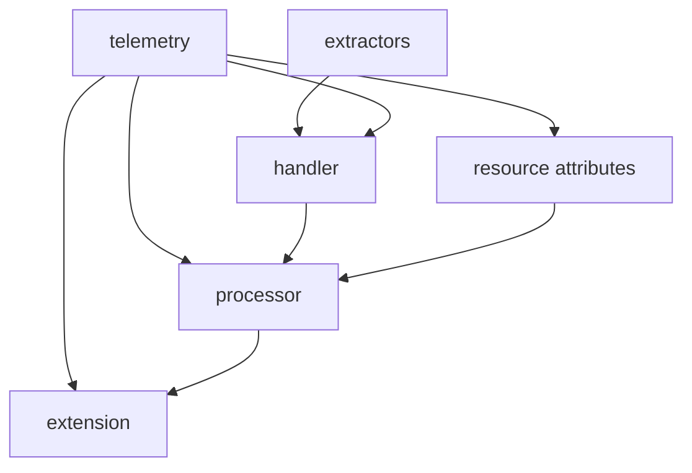
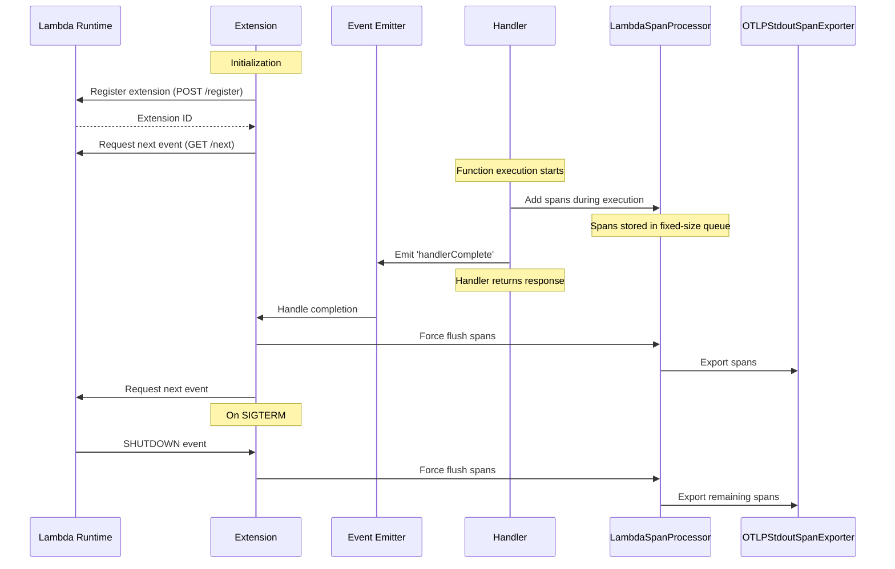

# Lambda OTel Lite

[](https://www.npmjs.com/package/@dev7a/lambda-otel-lite)

The `@dev7a/lambda-otel-lite` package provides a lightweight, efficient OpenTelemetry implementation specifically designed for AWS Lambda environments in Node.js. It features a custom span processor and internal extension mechanism that optimizes telemetry collection for Lambda's unique execution model.

By leveraging Lambda's execution lifecycle and providing multiple processing modes, this package enables efficient telemetry collection with minimal impact on function latency. By default, it uses the `@dev7a/otlp-stdout-span-exporter` to export spans to CloudWatch Logs, where they can be collected and forwarded by the [serverless-otlp-forwarder](https://github.com/dev7a/serverless-otlp-forwarder).

>[!IMPORTANT]
>This package is highly experimental and should not be used in production. Contributions are welcome.

## Table of Contents

- [Requirements](#requirements)
- [Features](#features)
- [Architecture and Modules](#architecture-and-modules)
- [Installation](#installation)
- [Quick Start](#quick-start)
- [Processing Modes](#processing-modes)
  - [Async Processing Mode Architecture](#async-processing-mode-architecture)
- [Telemetry Configuration](#telemetry-configuration)
  - [Custom configuration with custom resource attributes](#custom-configuration-with-custom-resource-attributes)
  - [Custom configuration with custom span processors](#custom-configuration-with-custom-span-processors)
  - [Custom configuration with context propagators](#custom-configuration-with-context-propagators)
  - [Library specific Resource Attributes](#library-specific-resource-attributes)
- [Event Extractors](#event-extractors)
  - [Automatic Attributes extraction](#automatic-attributes-extraction)
  - [Built-in Extractors](#built-in-extractors)
  - [Custom Extractors](#custom-extractors)
- [Environment Variables](#environment-variables)
  - [Processing Configuration](#processing-configuration)
  - [Resource Configuration](#resource-configuration)
  - [Export Configuration](#export-configuration)
  - [Logging](#logging)
  - [AWS Lambda Environment](#aws-lambda-environment)
- [License](#license)
- [See Also](#see-also)

## Requirements
- Node.js >= 18.0.0

## Features

- **Flexible Processing Modes**: Support for synchronous, asynchronous, and custom export strategies
- **Automatic Resource Detection**: Automatic extraction of Lambda environment attributes
- **Lambda Extension Integration**: Built-in extension for efficient telemetry export
- **Efficient Memory Usage**: Fixed-size queue to prevent memory growth
- **AWS Event Support**: Automatic extraction of attributes from common AWS event types (API Gateway v1/v2, ALB)
- **Flexible Context Propagation**: Support for W3C Trace Context

## Architecture and Modules

The package follows a modular architecture where each component has a specific responsibility while working together efficiently:



- `telemetry`: Core initialization and configuration
  - Main entry point via `initTelemetry`
  - Configures global tracer and span processors
  - Returns a `TelemetryCompletionHandler` for span lifecycle management

- `processor`: Lambda-optimized span processor
  - Fixed-size queue implementation
  - Multiple processing modes
  - Coordinates with extension for async export

- `extension`: Lambda Extension implementation
  - Manages extension lifecycle and registration
  - Handles span export coordination
  - Implements graceful shutdown

- `extractors`: Event processing
  - Built-in support for API Gateway and ALB events
  - Extensible interface for custom events
  - W3C Trace Context propagation

## Installation

```bash
# Install the base package
npm install --save @dev7a/lambda-otel-lite

# Optional: For OTLP HTTP export support
npm install --save @opentelemetry/exporter-trace-otlp-http
```

## Quick Start

```typescript
import { trace, StatusCode } from '@opentelemetry/api';
import { initTelemetry, createTracedHandler } from '@dev7a/lambda-otel-lite';
import { apiGatewayV2Extractor } from '@dev7a/lambda-otel-lite/extractors';

// Initialize telemetry once, outside the handler
const { tracer, completionHandler } = initTelemetry();

// Create traced handler with specific extractor
const traced = createTracedHandler(
  'my-api-handler',
  completionHandler,
  apiGatewayV2Extractor
);

// Define business logic separately
async function processUser(userId) {
  // Your business logic here
  return { name: 'User Name', id: userId };
}

// Create the Lambda handler
export const handler = traced(async (event, context) => {
  try {
    // Get current span to add custom attributes
    const currentSpan = trace.getActiveSpan();
    currentSpan?.setAttribute('handler.version', '1.0');
    
    // Extract userId from event path parameters
    const userId = event.pathParameters?.userId || 'unknown';
    currentSpan?.setAttribute('user.id', userId);
    
    // Process business logic
    const user = await processUser(userId);
    
    // Return formatted HTTP response
    return {
      statusCode: 200,
      headers: { 'Content-Type': 'application/json' },
      body: JSON.stringify({ success: true, data: user })
    };
  } catch (error) {
    // Simple error handling
    return {
      statusCode: 500,
      headers: { 'Content-Type': 'application/json' },
      body: JSON.stringify({ 
        success: false, 
        error: 'Internal server error' 
      })
    };
  }
});
```

## Processing Modes

The package supports three processing modes for span export:

1. **Sync Mode** (default):
   - Direct, synchronous export in handler thread
   - Recommended for:
     - low-volume telemetry
     - limited resources (memory, cpu)
     - when latency is not critical
   - Set via `LAMBDA_EXTENSION_SPAN_PROCESSOR_MODE=sync`

2. **Async Mode**:
   - Export via Lambda extension using AWS Lambda Extensions API
   - Spans are queued and exported after handler completion
   - Uses event-based communication between handler and extension
   - Registers specifically for Lambda INVOKE events
   - Implements graceful shutdown with SIGTERM handling
   - Error handling for:
     - Event communication failures
     - Export failures
     - Extension registration issues
   - Best for production use with high telemetry volume
   - Set via `LAMBDA_EXTENSION_SPAN_PROCESSOR_MODE=async`
   - Requires extension initialization: `NODE_OPTIONS=--require @dev7a/lambda-otel-lite/extension`

3. **Finalize Mode**:
   - Registers extension with no events
   - Maintains SIGTERM handler for graceful shutdown
   - Ensures all spans are flushed during shutdown
   - Compatible with BatchSpanProcessor for custom export strategies
   - Best for specialized export requirements where you need full control
   - Set via `LAMBDA_EXTENSION_SPAN_PROCESSOR_MODE=finalize`

### Async Processing Mode Architecture



The async mode leverages Lambda's extension API to optimize perceived latency by deferring span export until after the response is sent to the user. The extension is loaded via Node.js's `--require` flag and uses an event-driven architecture:

1. The extension is loaded at startup via `--require` flag
2. Uses Node.js's built-in `http` module for Lambda API communication
3. Leverages event emitters for handler completion notification
4. Single event loop handles both extension and handler code
5. SIGTERM handler ensures graceful shutdown with span flushing

## Telemetry Configuration

The package provides several ways to configure the OpenTelemetry tracing pipeline, which is a required first step to instrument your Lambda function:

### Custom configuration with custom resource attributes

```typescript
import { Resource } from '@opentelemetry/resources';
import { initTelemetry, createTracedHandler } from '@dev7a/lambda-otel-lite';

// Create a custom resource with additional attributes
const resource = new Resource({
  'service.version': '1.0.0',
  'deployment.environment': 'production',
  'custom.attribute': 'value'
});

// Initialize with custom resource
const { tracer, completionHandler } = initTelemetry({
  resource
});

// Use the tracer and completion handler as usual
```

### Custom configuration with custom span processors

```typescript
import { initTelemetry, createTracedHandler } from '@dev7a/lambda-otel-lite';
import { BatchSpanProcessor } from '@opentelemetry/sdk-trace-base';
import { OTLPTraceExporter } from '@opentelemetry/exporter-trace-otlp-http';

// Create a custom processor with OTLP HTTP exporter
const processor = new BatchSpanProcessor(
  new OTLPTraceExporter({
    url: 'https://your-otlp-endpoint/v1/traces'
  })
);

// Initialize with custom processor
const { tracer, completionHandler } = initTelemetry({
  spanProcessors: [processor]
});
```

You can provide multiple span processors, and they will all be used to process spans. This allows you to send telemetry to multiple destinations or use different processing strategies for different types of spans.

### Custom configuration with context propagators

```typescript
import { initTelemetry } from '@dev7a/lambda-otel-lite';
import { W3CTraceContextPropagator } from '@opentelemetry/core';
import { B3Propagator } from '@opentelemetry/propagator-b3';

// Initialize with custom propagators
const { tracer, completionHandler } = initTelemetry({
  propagators: [
    new W3CTraceContextPropagator(),  // W3C Trace Context
    new B3Propagator(),  // B3 format for Zipkin compatibility
  ]
});
```

By default, OpenTelemetry Node.js uses W3C Trace Context and W3C Baggage propagators. The `propagators` parameter allows you to customize which propagators are used for context extraction and injection. This is useful when you need to integrate with systems that use different context propagation formats.

You can provide multiple propagators, and they will be combined into a composite propagator. The order matters - propagators are applied in the order they are provided.

> **Note:** The OpenTelemetry SDK also supports configuring propagators via the `OTEL_PROPAGATORS` environment variable. If set, this environment variable takes precedence over programmatic configuration. See the [OpenTelemetry JavaScript documentation](https://opentelemetry.io/docs/languages/js/propagation/) for more details.

### Library specific Resource Attributes

The package adds several resource attributes under the `lambda_otel_lite` namespace to provide configuration visibility:

- `lambda_otel_lite.extension.span_processor_mode`: Current processing mode (`sync`, `async`, or `finalize`)
- `lambda_otel_lite.lambda_span_processor.queue_size`: Maximum number of spans that can be queued
- `lambda_otel_lite.lambda_span_processor.batch_size`: Maximum batch size for span export
- `lambda_otel_lite.otlp_stdout_span_exporter.compression_level`: GZIP compression level used for span export

These attributes are automatically added to the resource and can be used to understand the telemetry configuration in your observability backend.

## Event Extractors

Event extractors are responsible for extracting span attributes and context from Lambda event and context objects. The library provides built-in extractors for common Lambda triggers.

### Automatic Attributes extraction

The library automatically sets relevant FAAS attributes based on the Lambda context and event. Both `event` and `context` parameters must be passed to `tracedHandler` to enable all automatic attributes:

- Resource Attributes (set at initialization):
  - `cloud.provider`: "aws"
  - `cloud.region`: from AWS_REGION
  - `faas.name`: from AWS_LAMBDA_FUNCTION_NAME
  - `faas.version`: from AWS_LAMBDA_FUNCTION_VERSION
  - `faas.instance`: from AWS_LAMBDA_LOG_STREAM_NAME
  - `faas.max_memory`: from AWS_LAMBDA_FUNCTION_MEMORY_SIZE
  - `service.name`: from OTEL_SERVICE_NAME (defaults to function name)
  - Additional attributes from OTEL_RESOURCE_ATTRIBUTES (URL-decoded)

- Span Attributes (set per invocation when passing context):
  - `faas.cold_start`: true on first invocation
  - `cloud.account.id`: extracted from context's invokedFunctionArn
  - `faas.invocation_id`: from awsRequestId
  - `cloud.resource_id`: from context's invokedFunctionArn

- HTTP Attributes (set for API Gateway events):
  - `faas.trigger`: "http"
  - `http.status_code`: from handler response
  - `http.route`: from routeKey (v2) or resource (v1)
  - `http.method`: from requestContext (v2) or httpMethod (v1)
  - `http.target`: from path
  - `http.scheme`: from protocol

The library automatically detects API Gateway v1 and v2 events and sets the appropriate HTTP attributes. For HTTP responses, the status code is automatically extracted from the handler's response and set as `http.status_code`. For 5xx responses, the span status is set to ERROR.

### Built-in Extractors

```typescript
import {
    apiGatewayV1Extractor,  // API Gateway REST API
    apiGatewayV2Extractor,  // API Gateway HTTP API
    albExtractor,           // Application Load Balancer
    defaultExtractor        // Basic Lambda attributes
} from '@dev7a/lambda-otel-lite/extractors';
```

Each extractor is designed to handle a specific event type and extract relevant attributes:

- `apiGatewayV1Extractor`: Extracts HTTP attributes from API Gateway REST API events
- `apiGatewayV2Extractor`: Extracts HTTP attributes from API Gateway HTTP API events
- `albExtractor`: Extracts HTTP attributes from Application Load Balancer events
- `defaultExtractor`: Extracts basic Lambda attributes from any event type


```typescript
import { apiGatewayV1Extractor } from '@dev7a/lambda-otel-lite/extractors';

// Initialize telemetry with default configuration
const { tracer, completionHandler } = initTelemetry();

export const traced = createTracedHandler(
    'api-v1-handler',
    completionHandler,
    apiGatewayV1Extractor
);

export const handler = traced(async (event, context) => {
    // Your handler code
    return {
        statusCode: 200,
        body: JSON.stringify({ message: 'Hello, world!' })
    };
});
```

### Custom Extractors

You can create custom extractors for event types not directly supported by the library by implementing the extractor interface:

```typescript
import { SpanAttributes, TriggerType } from '@dev7a/lambda-otel-lite/types';

const customExtractor = (event, context): SpanAttributes => ({
    trigger: TriggerType.OTHER,  // Or any custom string
    attributes: {
        'custom.attribute': 'value',
        // ... other attributes
    },
    spanName: 'custom-operation',  // Optional
    carrier: event?.headers,  // Optional: For context propagation
});

export const traced = createTracedHandler(
    'custom-handler',
    completionHandler,
    customExtractor
);

export const handler = traced(async (event, context) => {
    // Your handler code
    return {
        statusCode: 200,
        body: JSON.stringify({ message: 'Hello, world!' })
    };
});
```

The `SpanAttributes` object returned by the extractor contains:

- `trigger`: The type of trigger (HTTP, SQS, etc.) - affects how spans are named
- `attributes`: An attributes object to add to the span
- `spanName`: Optional custom name for the span (defaults to handler name)
- `carrier`: Optional object containing trace context headers for propagation


## Environment Variables

The package can be configured using the following environment variables:

### Processing Configuration
- `LAMBDA_EXTENSION_SPAN_PROCESSOR_MODE`: Controls span processing strategy
  - `sync`: Direct export in handler thread (default)
  - `async`: Deferred export via extension
  - `finalize`: Custom export strategy
- `LAMBDA_SPAN_PROCESSOR_QUEUE_SIZE`: Maximum number of spans to queue (default: 2048)
- `LAMBDA_SPAN_PROCESSOR_BATCH_SIZE`: Maximum number of spans to export in each batch (default: 512)

### Resource Configuration
- `OTEL_SERVICE_NAME`: Override the service name (defaults to function name)
- `OTEL_RESOURCE_ATTRIBUTES`: Additional resource attributes in key=value,key2=value2 format

### Export Configuration
- `OTLP_STDOUT_SPAN_EXPORTER_COMPRESSION_LEVEL`: Gzip compression level for stdout exporter
  - 0: No compression
  - 1: Best speed
  - 6: Good balance between size and speed (default)
  - 9: Best compression

### Logging
- `AWS_LAMBDA_LOG_LEVEL` or `LOG_LEVEL`: Configure log level (debug, info, warn, error, none)

### AWS Lambda Environment
The following AWS Lambda environment variables are automatically used for resource attributes:
- `AWS_REGION`: Region where function runs
- `AWS_LAMBDA_FUNCTION_NAME`: Function name
- `AWS_LAMBDA_FUNCTION_VERSION`: Function version
- `AWS_LAMBDA_LOG_STREAM_NAME`: Log stream name
- `AWS_LAMBDA_FUNCTION_MEMORY_SIZE`: Function memory size


## License

[MIT License](LICENSE)

## See Also

- [GitHub](https://github.com/dev7a/serverless-otlp-forwarder) - The main project repository for the Serverless OTLP Forwarder project
- [GitHub](https://github.com/dev7a/serverless-otlp-forwarder/tree/main/packages/python/lambda-otel-lite) | [PyPI](https://pypi.org/project/lambda-otel-lite/) - The Python version of this library
- [GitHub](https://github.com/dev7a/serverless-otlp-forwarder/tree/main/packages/rust/lambda-otel-lite) | [crates.io](https://crates.io/crates/lambda-otel-lite) - The Rust version of this library
