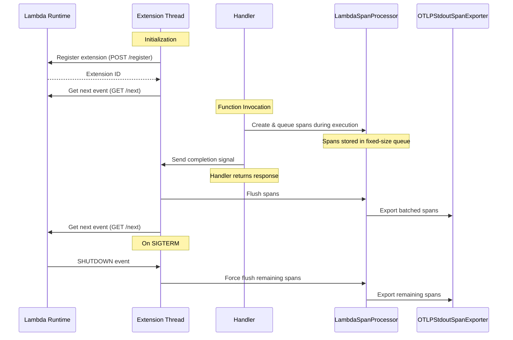

# Lambda OTel Lite

[](https://crates.io/crates/lambda-otel-lite)

The `lambda-otel-lite` crate provides a lightweight, efficient OpenTelemetry implementation specifically designed for AWS Lambda environments. It features a custom span processor and internal extension mechanism that optimizes telemetry collection for Lambda's unique execution model.

By leveraging Lambda's execution lifecycle and providing multiple processing modes, this crate enables efficient telemetry collection with minimal impact on function latency. By default, it uses the `otlp-stdout-span-exporter` to export spans to stdout for the [serverless-otlp-forwarder](https://github.com/dev7a/serverless-otlp-forwarder) project.

>[!IMPORTANT]
>This crate is highly experimental and should not be used in production. Contributions are welcome.

## Table of Contents

- [Requirements](#requirements)
- [Features](#features)
- [Architecture and Modules](#architecture-and-modules)
- [Installation](#installation)
- [Quick Start](#quick-start)
- [Processing Modes](#processing-modes)
  - [Async Processing Mode Architecture](#async-processing-mode-architecture)
- [Telemetry Configuration](#telemetry-configuration)
  - [Custom configuration with custom resource attributes](#custom-configuration-with-custom-resource-attributes)
  - [Custom configuration with context propagators](#custom-configuration-with-context-propagators)
  - [Custom configuration with custom span processors](#custom-configuration-with-custom-span-processors)
  - [Using the Tower Layer](#using-the-tower-layer)
  - [Using the handler wrapper function](#using-the-handler-wrapper-function)
  - [Library specific Resource Attributes](#library-specific-resource-attributes)
- [Event Extractors](#event-extractors)
  - [Automatic Attributes extraction](#automatic-attributes-extraction)
  - [Built-in Extractors](#built-in-extractors)
  - [Custom Extractors](#custom-extractors)
  - [Handling Standard AWS Lambda Events](#handling-standard-aws-lambda-events)
- [Environment Variables](#environment-variables)
  - [Processing Configuration](#processing-configuration)
  - [Resource Configuration](#resource-configuration)
  - [Export Configuration](#export-configuration)
  - [Logging and Debug](#logging-and-debug)
- [License](#license)
- [See Also](#see-also)

## Requirements

- Rust 1.70+
- AWS Lambda Rust Runtime
- OpenTelemetry packages (automatically included as dependencies)

## Features

- **Flexible Processing Modes**: Support for synchronous, asynchronous, and custom export strategies
- **Automatic Resource Detection**: Automatic extraction of Lambda environment attributes
- **Lambda Extension Integration**: Built-in extension for efficient telemetry export
- **Efficient Memory Usage**: Fixed-size queue to prevent memory growth
- **AWS Event Support**: Automatic extraction of attributes from common AWS event types
- **Flexible Context Propagation**: Support for W3C Trace Context, AWS X-Ray, and custom propagators

## Architecture and Modules

- `telemetry`: Core initialization and configuration
  - Main entry point via `init_telemetry`
  - Configures global tracer and span processors
  - Returns a `TelemetryCompletionHandler` for span lifecycle management

- `processor`: Lambda-optimized span processor
  - Fixed-size queue implementation
  - Multiple processing modes
  - Coordinates with extension for async export

- `extension`: Lambda Extension implementation
  - Manages extension lifecycle and registration
  - Handles span export coordination
  - Implements graceful shutdown

- `resource`: Resource attribute management
  - Automatic Lambda attribute detection
  - Environment-based configuration
  - Custom attribute support

- `constants`: Centralized configuration constants
  - Environment variable names
  - Default values
  - Resource attribute keys
  - Ensures consistency across the codebase

- `extractors`: Event processing
  - Built-in support for API Gateway and ALB events
  - Extensible trait system for custom events
  - W3C Trace Context and AWS X-Ray propagation

- `layer`: Tower middleware integration
  - Best for complex services with middleware chains
  - Integrates with Tower's service ecosystem
  - Standardized instrumentation across services

- `handler`: Direct function wrapper
  - Provides `create_traced_handler` function to wrap Lambda handlers
  - Automatically tracks cold starts using the `faas.cold_start` attribute
  - Extracts and propagates trace context from event carriers
  - Manages span lifecycle with automatic status handling for HTTP responses
  - Records exceptions in spans with appropriate status codes
  - Properly completes telemetry processing on handler completion
  - Supports reuse of handler functions with efficient boxing strategy


## Installation

Add the crate to your project:
```bash
cargo add lambda-otel-lite
```

## Quick Start

```rust, no_run
use aws_lambda_events::apigw::{ApiGatewayV2httpRequest, ApiGatewayV2httpResponse};
use aws_lambda_events::encodings::Body;
use http::header::HeaderMap;
use lambda_otel_lite::{create_traced_handler, init_telemetry, TelemetryConfig};
use lambda_runtime::{service_fn, Error, LambdaEvent, Runtime};
use opentelemetry::KeyValue;
use serde_json::{json, Value};
use std::collections::HashMap;
use tracing_opentelemetry::OpenTelemetrySpanExt;

// Business logic function
async fn process_user(user_id: &str) -> Result<Value, Error> {
    // Your business logic here
    Ok(json!({
        "name": "User Name",
        "id": user_id
    }))
}

#[tokio::main]
async fn main() -> Result<(), Error> {
    // Initialize telemetry with default configuration
    let (tracer, completion_handler) = init_telemetry(TelemetryConfig::default()).await?;
    
    // Create a traced handler function
    let handler = create_traced_handler(
        "my-api-handler", 
        completion_handler, 
        handler_function
    );
    
    // Run the Lambda runtime with our handler
    Runtime::new(service_fn(handler)).run().await
}

// Define the handler function
async fn handler_function(event: LambdaEvent<ApiGatewayV2httpRequest>) -> Result<ApiGatewayV2httpResponse, Error> {
    // Extract current span and add custom attributes
    let span = tracing::Span::current();
    span.set_attribute("handler.version", "1.0");
    
    // Extract request information
    let request = event.payload;
    let context = event.context;
    
    // Extract userId from path parameters
    let user_id = request
        .path_parameters
        .get("userId")
        .cloned()
        .unwrap_or_else(|| "unknown".to_string());
    
    // Add user ID to span
    let span = tracing::Span::current();
    span.set_attribute("user.id", user_id.clone());
    
    // Process the request
    let response = match process_user(&user_id).await {
        Ok(user) => {
            // Create success response
            let body = json!({
                "success": true,
                "data": user
            }).to_string();
            
            ApiGatewayV2httpResponse {
                status_code: 200,
                headers: HeaderMap::new(),
                body: Some(body.into()),
                ..Default::default()
            }
        },
        Err(error) => {
            // Simple error handling
            let body = json!({
                "success": false,
                "error": "Internal server error"
            }).to_string();
            
            ApiGatewayV2httpResponse {
                status_code: 500,
                headers: HeaderMap::new(),
                body: Some(body.into()),
                ..Default::default()
            }
        }
    };
    
    Ok(response)
}
```


## Processing Modes

The crate supports three processing modes for span export:

1. **Sync Mode** (default):
   - Direct, synchronous export in handler thread
   - Recommended for:
     - low-volume telemetry
     - limited resources (memory, cpu)
     - when latency is not critical
   - Set via `LAMBDA_EXTENSION_SPAN_PROCESSOR_MODE=sync`

2. **Async Mode**:
   - Export via Lambda extension using AWS Lambda Extensions API
   - Spans are queued and exported after handler completion
   - Uses channel-based communication between handler and extension
   - Registers specifically for Lambda INVOKE events
   - Implements graceful shutdown with SIGTERM handling
   - Error handling for:
     - Channel communication failures
     - Export failures
     - Extension registration issues
   - Best for production use with high telemetry volume
   - Set via `LAMBDA_EXTENSION_SPAN_PROCESSOR_MODE=async`

3. **Finalize Mode**:
   - Registers extension with no events
   - Maintains SIGTERM handler for graceful shutdown
   - Ensures all spans are flushed during shutdown
   - Compatible with BatchSpanProcessor for custom export strategies
   - Best for specialized export requirements where you need full control
   - Set via `LAMBDA_EXTENSION_SPAN_PROCESSOR_MODE=finalize`

### Async Processing Mode Architecture

The async mode leverages Lambda's extension API to optimize perceived latency by deferring span export until after the response is sent to the user:


The async mode leverages Lambda's extension API to optimize perceived latency by deferring span export until after the response is sent to the user. The diagram above shows the core coordination between components:

1. Extension thread registers with the Lambda Runtime and awaits events
2. Handler creates and queues spans during execution via LambdaSpanProcessor
3. Handler signals completion to the extension thread before returning
4. Extension thread processes and exports queued spans after handler completes
5. Extension thread returns to waiting for the next event
6. On shutdown (SIGTERM), remaining spans are flushed and exported

## Telemetry Configuration

The crate provides several ways to configure the open telemetry tracing pipeline, which is a required first step to instrument your lambda function:

### Custom configuration with custom resource attributes:

```rust, no_run
use lambda_otel_lite::{init_telemetry, TelemetryConfig};
use opentelemetry::KeyValue;
use opentelemetry_sdk::Resource;
use lambda_runtime::Error;

#[tokio::main]
async fn main() -> Result<(), Error> {
    let resource = Resource::builder()
        .with_attributes(vec![
            KeyValue::new("service.version", "1.0.0"),
            KeyValue::new("deployment.environment", "production"),
        ])
        .build();

    let config = TelemetryConfig::builder()
        .resource(resource)
        .build();

    let (_, completion_handler) = init_telemetry(config).await?;

    // Use the tracer and completion handler as usual
    
    Ok(())
}
```

### Custom configuration with custom span processors:

```rust, no_run
use lambda_otel_lite::{init_telemetry, TelemetryConfig};
use opentelemetry_sdk::trace::SimpleSpanProcessor;
use otlp_stdout_span_exporter::OtlpStdoutSpanExporter;
use lambda_runtime::Error;

#[tokio::main]
async fn main() -> Result<(), Error> {
    let config = TelemetryConfig::builder()
        .with_span_processor(SimpleSpanProcessor::new(
            Box::new(OtlpStdoutSpanExporter::default())
        ))
        .enable_fmt_layer(true)
        .build();

    let (_, completion_handler) = init_telemetry(config).await?;
    Ok(())
}
```

Note that the `.with_span_processor` method accepts a `SpanProcessor` trait object, so you can pass in any type that implements the `SpanProcessor` trait, and can be called multiple times. The order of the processors is the order of the calls to `.with_span_processor`.

### Custom configuration with context propagators:
```rust, no_run
use lambda_otel_lite::{init_telemetry, TelemetryConfig, propagation::LambdaXrayPropagator};
use opentelemetry_sdk::propagation::{BaggagePropagator, TraceContextPropagator};
use opentelemetry_aws::trace::XrayPropagator;
use lambda_runtime::Error;

#[tokio::main]
async fn main() -> Result<(), Error> {
    let config = TelemetryConfig::builder()
        // Add W3C Trace Context propagator (default)
        .with_propagator(TraceContextPropagator::new())
        // Add AWS X-Ray propagator
        .with_propagator(XrayPropagator::new())
        // Add Lambda-enhanced X-Ray propagator (with _X_AMZN_TRACE_ID environment variable support)
        .with_propagator(LambdaXrayPropagator::new())
        // Add W3C Baggage propagator
        .with_propagator(BaggagePropagator::new())
        .build();

    let (_, completion_handler) = init_telemetry(config).await?;

    // Use the tracer and completion handler as usual
    
    Ok(())
}
```

By default, the crate combines two propagators: W3C Trace Context (`TraceContextPropagator`) and the Lambda-specific X-Ray propagator (`LambdaXrayPropagator`), providing out-of-the-box support for both industry-standard tracing and AWS-specific tracing. You can add additional propagators using the `with_propagator` method, or use `with_named_propagator` with the following options:

- `"tracecontext"`: W3C Trace Context propagator
- `"xray"`: Standard AWS X-Ray propagator
- `"xray-lambda"`: Enhanced X-Ray propagator with Lambda environment variable support
- `"none"`: No propagation (disables context propagation)

Multiple propagators are combined into a composite propagator that can handle various trace context formats.

### Using the Tower Layer
You can "wrap" your handler in the `OtelTracingLayer` using the `ServiceBuilder` from the `tower` crate:

```rust, no_run
use lambda_otel_lite::{init_telemetry, TelemetryConfig, OtelTracingLayer};
use lambda_runtime::{service_fn, Error, LambdaEvent, Runtime};
use lambda_runtime::tower::ServiceBuilder;
use aws_lambda_events::event::apigw::ApiGatewayV2httpRequest;
use serde_json::Value;

async fn handler(event: LambdaEvent<ApiGatewayV2httpRequest>) -> Result<Value, Error> {
    Ok(serde_json::json!({
        "statusCode": 200,
        "body": format!("Hello from request {}", event.context.request_id)
    }))
}

#[tokio::main]
async fn main() -> Result<(), Error> {
    // Initialize telemetry with default configuration
    let (_, completion_handler) = init_telemetry(TelemetryConfig::default()).await?;

    // Build service with OpenTelemetry tracing middleware
    let service = ServiceBuilder::new()
        .layer(OtelTracingLayer::new(completion_handler).with_name("tower-handler"))
        .service_fn(handler);

    // Create and run the Lambda runtime
    Runtime::new(service).run().await
}
```

### Using the handler wrapper function
Or, you can use the `create_traced_handler` function to wrap your handler:

```rust, no_run
use lambda_otel_lite::{init_telemetry, TelemetryConfig, create_traced_handler};
use lambda_runtime::{service_fn, Error, LambdaEvent, Runtime};
use aws_lambda_events::event::apigw::ApiGatewayV2httpRequest;
use serde_json::Value;

async fn handler(event: LambdaEvent<ApiGatewayV2httpRequest>) -> Result<Value, Error> {
    Ok(serde_json::json!({ "statusCode": 200 }))
}

#[tokio::main]
async fn main() -> Result<(), Error> {
    let (_, completion_handler) = init_telemetry(TelemetryConfig::default()).await?;
    
    let handler = create_traced_handler(
        "my-handler",
        completion_handler,
        handler
    );

    Runtime::new(service_fn(handler)).run().await
}
```

### Library specific Resource Attributes

The crate adds several resource attributes under the `lambda_otel_lite` namespace to provide configuration visibility:

- `lambda_otel_lite.extension.span_processor_mode`: Current processing mode (`sync`, `async`, or `finalize`)
- `lambda_otel_lite.lambda_span_processor.queue_size`: Maximum number of spans that can be queued
- `lambda_otel_lite.lambda_span_processor.batch_size`: Maximum batch size for span export
- `lambda_otel_lite.otlp_stdout_span_exporter.compression_level`: GZIP compression level used for span export

These attributes are automatically added to the resource and can be used to understand the telemetry configuration in your observability backend.

## Event Extractors

Event extractors are responsible for extracting span attributes and context from Lambda event and context objects. The crate provides built-in extractors for common Lambda triggers.

### Automatic Attributes extraction

The crate automatically sets relevant FAAS attributes based on the Lambda context and event:

- Resource Attributes (set at initialization):
  - `cloud.provider`: "aws"
  - `cloud.region`: from AWS_REGION
  - `faas.name`: from AWS_LAMBDA_FUNCTION_NAME
  - `faas.version`: from AWS_LAMBDA_FUNCTION_VERSION
  - `faas.instance`: from AWS_LAMBDA_LOG_STREAM_NAME
  - `faas.max_memory`: from AWS_LAMBDA_FUNCTION_MEMORY_SIZE
  - `service.name`: from OTEL_SERVICE_NAME (defaults to function name)
  - Additional attributes from OTEL_RESOURCE_ATTRIBUTES

- Span Attributes (set per invocation):
  - `faas.cold_start`: true on first invocation
  - `cloud.account.id`: extracted from context's invokedFunctionArn
  - `faas.invocation_id`: from awsRequestId
  - `cloud.resource_id`: from context's invokedFunctionArn

- HTTP Attributes (set for API Gateway events):
  - `faas.trigger`: "http"
  - `http.status_code`: from handler response
  - `http.route`: from routeKey (v2) or resource (v1)
  - `http.method`: from requestContext (v2) or httpMethod (v1)
  - `http.target`: from path
  - `http.scheme`: from protocol

The crate automatically detects API Gateway v1 and v2 events and sets the appropriate HTTP attributes. For HTTP responses, the status code is automatically extracted from the handler's response and set as `http.status_code`. For 5xx responses, the span status is set to ERROR.

### Built-in Extractors

The crate provides built-in support for extracting span attributes from common AWS event types:

- API Gateway REST API (v1)
- API Gateway HTTP API (v2)
- Application Load Balancer (ALB)

Each extractor is designed to handle a specific event type and extract relevant attributes, including trace context propagation from HTTP headers (both W3C Trace Context and AWS X-Ray formats).

### Custom Extractors

For other events than the ones directly supported by the crate, you can implement the `SpanAttributesExtractor` trait for your own event types:

```rust, no_run
use lambda_otel_lite::{init_telemetry, TelemetryConfig, create_traced_handler, SpanAttributes, SpanAttributesExtractor};
use lambda_runtime::{service_fn, Error, LambdaEvent, Runtime};
use serde::{Deserialize, Serialize};
use std::collections::HashMap;
use opentelemetry::Value;
use serde_json::Value as JsonValue;

// Define a custom event type
#[derive(Clone, Deserialize, Serialize)]
struct MyEvent {
    user_id: String,
    trace_parent: Option<String>,
    xray_trace_id: Option<String>,
}

// Implement SpanAttributesExtractor for the custom event
impl SpanAttributesExtractor for MyEvent {
    fn extract_span_attributes(&self) -> SpanAttributes {
        let mut attributes = HashMap::new();
        attributes.insert("user.id".to_string(), Value::String(self.user_id.clone().into()));

        // Add trace context if available
        let mut carrier = HashMap::new();
        // Add W3C Trace Context header
        if let Some(header) = &self.trace_parent {
            carrier.insert("traceparent".to_string(), header.clone());
        }
        // Add X-Ray trace header
        if let Some(header) = &self.xray_trace_id {
            carrier.insert("x-amzn-trace-id".to_string(), header.clone());
        }

        SpanAttributes::builder()
            .attributes(attributes)
            .carrier(carrier)
            .build()
    }
}

async fn handler(event: LambdaEvent<MyEvent>) -> Result<JsonValue, Error> {
    Ok(serde_json::json!({
        "statusCode": 200,
        "body": format!("Hello, user {}", event.payload.user_id)
    }))
}

#[tokio::main]
async fn main() -> Result<(), Error> {
    let config = TelemetryConfig::default();
    let (_, completion_handler) = init_telemetry(config).await?;
    
    let handler = create_traced_handler(
        "my-handler",
        completion_handler,
        handler
    );

    Runtime::new(service_fn(handler)).run().await
}
```

The `SpanAttributes` object returned by the extractor contains:

- `attributes`: A map of attributes to add to the span
- `carrier`: Optional map containing trace context headers for propagation (supports both W3C and X-Ray formats)
- `span_name`: Optional custom name for the span (defaults to handler name)

### Handling Standard AWS Lambda Events

For standard AWS Lambda event types provided by the `aws-lambda-events` crate that don't have built-in extractors, you can create a newtype wrapper and implement the `SpanAttributesExtractor` trait for it. This approach is necessary due to Rust's orphan rule, which prevents implementing external traits for external types directly.

Here's an example for Kinesis events:

```rust, no_run
use aws_lambda_events::event::kinesis::KinesisEvent;
use lambda_otel_lite::{init_telemetry, TelemetryConfig, create_traced_handler, SpanAttributes, SpanAttributesExtractor};
use lambda_runtime::{service_fn, Error, LambdaEvent, Runtime};
use opentelemetry::Value;
use serde::{Deserialize, Serialize};
use std::collections::HashMap;

// Create a newtype wrapper around KinesisEvent
#[derive(Clone, Debug, Serialize, Deserialize)]
struct KinesisEventWrapper(pub KinesisEvent);

// Implement SpanAttributesExtractor for the wrapper
impl SpanAttributesExtractor for KinesisEventWrapper {
    fn extract_span_attributes(&self) -> SpanAttributes {
        let mut attributes: HashMap<String, Value> = HashMap::new();
        let records = &self.0.records;
        
        // Add attributes from the Kinesis event
        attributes.insert(
            "forwarder.events.count".to_string(),
            Value::I64(records.len() as i64),
        );
        
        // Extract stream name from the first record if available
        if let Some(first_record) = records.first() {
            if let Some(event_source) = &first_record.event_source {
                attributes.insert(
                    "forwarder.stream.name".to_string(),
                    Value::String(event_source.clone().into()),
                );
            }
        }

        SpanAttributes::builder()
            .span_name("kinesis-processor".to_string())
            .attributes(attributes)
            .build()
    }
}

// Handler function that uses the wrapper
async fn function_handler(
    event: LambdaEvent<KinesisEventWrapper>,
) -> Result<(), Error> {
    // Process Kinesis records
    let records = &event.payload.0.records;
    
    // Your processing logic here
    
    Ok(())
}

#[tokio::main]
async fn main() -> Result<(), Error> {
    // Initialize telemetry
    let (_, completion_handler) = init_telemetry(TelemetryConfig::default()).await?;
    
    // Create traced handler with the wrapper
    let handler = create_traced_handler(
        "kinesis-processor",
        completion_handler,
        function_handler
    );

    // Run the Lambda runtime
    Runtime::new(service_fn(handler)).run().await
}
```

This pattern can be applied to any event type from the `aws-lambda-events` crate, such as:
- SQS events
- SNS events
- DynamoDB events
- S3 events
- CloudWatch events
- And more

By creating a newtype wrapper, you can add custom span attributes specific to each event type while maintaining type safety and satisfying Rust's orphan rule.

## Environment Variables

The library uses environment variables for configuration, with a clear precedence order:

1. Environment variables (highest precedence)
2. Constructor parameters 
3. Default values (lowest precedence)

### Processing Configuration

- `LAMBDA_EXTENSION_SPAN_PROCESSOR_MODE`: Controls processing mode
  - `"sync"` for Sync mode (default)
  - `"async"` for Async mode
  - `"finalize"` for Finalize mode
- `LAMBDA_SPAN_PROCESSOR_QUEUE_SIZE`: Maximum spans to queue (default: 2048)
- `LAMBDA_SPAN_PROCESSOR_BATCH_SIZE`: Maximum batch size (default: 512)

### Resource Configuration

- `OTEL_SERVICE_NAME`: Service name for spans (falls back to `AWS_LAMBDA_FUNCTION_NAME`)
- `OTEL_RESOURCE_ATTRIBUTES`: Additional resource attributes in format: `key=value,key2=value2`

Resource attributes from environment variables are only included in the resource when the environment variable is explicitly set. This ensures that the reported resource attributes accurately reflect the actual configuration used.

### Export Configuration

- `OTLP_STDOUT_SPAN_EXPORTER_COMPRESSION_LEVEL`: GZIP compression level (0-9, default: 6)

### Logging and Debug
- `LAMBDA_TRACING_ENABLE_FMT_LAYER`: Enable console output of spans for debugging (default: false)
- `RUST_LOG` or `AWS_LAMBDA_LOG_LEVEL`: Configure log level for the crate
  - `RUST_LOG` takes precedence if both are set
  - Example: `RUST_LOG=lambda_otel_lite=debug`
  - Example: `AWS_LAMBDA_LOG_LEVEL=DEBUG` (used if RUST_LOG is not set)
  - Can be customized via `TelemetryConfig::builder().env_var_name("CUSTOM_LOG_VAR")`

## License

This project is licensed under the MIT License - see the [LICENSE](LICENSE) file for details.

## See Also

- [GitHub](https://github.com/dev7a/serverless-otlp-forwarder) - The main project repository for the Serverless OTLP Forwarder project
- [GitHub](https://github.com/dev7a/serverless-otlp-forwarder/tree/main/packages/node/lambda-otel-lite) | [npm](https://www.npmjs.com/package/@dev7a/lambda-otel-lite) - The Node.js version of this library
- [GitHub](https://github.com/dev7a/serverless-otlp-forwarder/tree/main/packages/python/lambda-otel-lite) | [PyPI](https://pypi.org/project/lambda-otel-lite/) - The Python version of this library