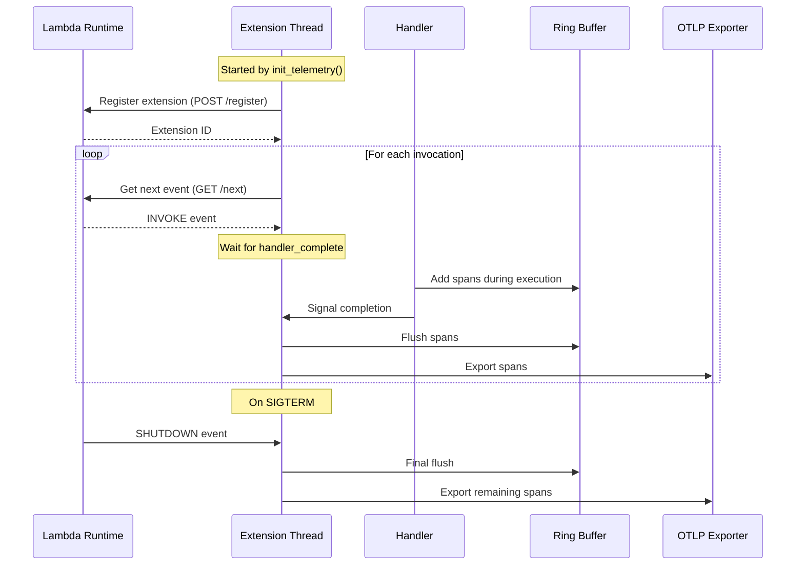

# Lambda OTel Lite

The `lambda-otel-lite` crate provides a lightweight, efficient OpenTelemetry implementation specifically designed for AWS Lambda environments. It features a custom span processor and internal extension mechanism that optimizes telemetry collection for Lambda's unique execution model.

By leveraging Lambda's execution lifecycle and providing multiple processing modes, this crate enables efficient telemetry collection with minimal impact on function latency. By default, it uses the `otlp-stdout-span-exporter` to export spans to stdout for the [serverless-otlp-forwarder](https://github.com/dev7a/serverless-otlp-forwarder) project.

>[!IMPORTANT]
>This crate is highly experimental and should not be used in production. Contributions are welcome.

## Features

- Lambda-optimized span processor with ring buffer for efficient memory usage
- Three processing modes for different use cases:
  - Synchronous: Immediate span export
  - Asynchronous: Background processing via internal extension
  - Finalize: Compatible with standard BatchSpanProcessor
- Internal extension thread for asynchronous mode
- Tower middleware for automatic instrumentation
- Function wrapper for manual instrumentation
- Automatic Lambda resource detection
- Automatic FAAS attributes from Lambda context and events
- Automatic attribute extraction from common AWS event types:
  - API Gateway v1/v2
  - Application Load Balancer
- Distributed tracing with automatic context propagation
- Cold start detection and tracking
- Configurable through environment variables
- Optimized for cold start performance

## Installation

Add the following to your `Cargo.toml`:

```toml
[dependencies]
lambda-otel-lite = "0.1.0"
```

## Usage

### Telemetry Configuration

The crate provides several ways to configure telemetry:

Basic usage with default configuration:
```rust
use lambda_otel_lite::{init_telemetry, TelemetryConfig};
use lambda_runtime::Error;

#[tokio::main]
async fn main() -> Result<(), Error> {
    let completion_handler = init_telemetry(TelemetryConfig::default()).await?;
    Ok(())
}
```

Custom configuration with custom resource attributes:
```rust
use lambda_otel_lite::{init_telemetry, TelemetryConfigBuilder};
use opentelemetry::KeyValue;
use opentelemetry_sdk::Resource;
use lambda_runtime::Error;

#[tokio::main]
async fn main() -> Result<(), Error> {
    let resource = Resource::new(vec![
        KeyValue::new("service.version", "1.0.0"),
        KeyValue::new("deployment.environment", "production"),
    ]);

    let config = TelemetryConfigBuilder::default()
        .with_resource(resource)
        .build();

    let completion_handler = init_telemetry(config).await?;
    Ok(())
}
```

Custom configuration with custom span processor:
```rust
use lambda_otel_lite::{init_telemetry, TelemetryConfigBuilder};
use opentelemetry_sdk::trace::SimpleSpanProcessor;
use otlp_stdout_span_exporter::OtlpStdoutSpanExporter;
use lambda_runtime::Error;

#[tokio::main]
async fn main() -> Result<(), Error> {
    let config = TelemetryConfigBuilder::default()
        // Add a custom span processor (disables default Lambda processor)
        .with_span_processor(SimpleSpanProcessor::new(
            Box::new(OtlpStdoutSpanExporter::default())
        ))
        // Set custom library name (defaults to "lambda-otel-lite")
        .with_library_name("my-service")
        // Enable trace data in application logs (defaults to false)
        .with_fmt_layer(true)
        .build();

    let completion_handler = init_telemetry(config).await?;
    Ok(())
}
```

### Basic Usage with Tower Layer

```rust no_run
use lambda_otel_lite::{init_telemetry, TelemetryConfig, OtelTracingLayer};
use lambda_runtime::{service_fn, Error, LambdaEvent};
use tower::ServiceBuilder;
use aws_lambda_events::apigw::ApiGatewayV2httpRequest;

async fn handler(event: LambdaEvent<ApiGatewayV2httpRequest>) -> Result<serde_json::Value, Error> {
    Ok(serde_json::json!({"status": "ok"}))
}

#[tokio::main]
async fn main() -> Result<(), Error> {
    // Initialize telemetry with default configuration
    let completion_handler = init_telemetry(TelemetryConfig::default()).await?;

    // Create service with tracing layer
    let service = ServiceBuilder::new()
        .layer(OtelTracingLayer::new(completion_handler.clone()))
        .service_fn(handler);

    lambda_runtime::run(service).await
}
```

### Traced Handler Instrumentation

```rust no_run
use lambda_otel_lite::{init_telemetry, TelemetryConfig, traced_handler, TracedHandlerOptions};
use lambda_runtime::{service_fn, Error, LambdaEvent};
use serde_json::Value;

async fn handler(event: LambdaEvent<Value>) -> Result<Value, Error> {
    Ok(event.payload)
}

#[tokio::main]
async fn main() -> Result<(), Error> {
    let completion_handler = init_telemetry(TelemetryConfig::default()).await?;

    lambda_runtime::run(service_fn(|event| {
        traced_handler(
            TracedHandlerOptions::default()
                .with_name("my-handler")
                .with_event(event),  // Enables automatic FAAS attributes and context propagation for HTTP events
            completion_handler.clone(),
            handler,
        )
    })).await
}
```

### Choosing Between Layer and Handler

The crate provides two approaches to instrumenting your Lambda functions:

1. **Tower Layer**:
   - Uses Tower's middleware system
   - Follows functional composition style
   - Easy to combine with other Tower middleware
   - Familiar if you're already using Tower in your stack

2. **Traced Handler**:
   - Direct function wrapping approach
   - More straightforward if you prefer imperative style
   - Simple to add to existing handlers
   - Familiar if you're using other function decorators/wrappers

Both approaches provide the same functionality and performance characteristics. The choice between them is primarily about coding style preference and how you prefer to structure your applications.

### Automatic FAAS Attributes

The crate automatically sets relevant FAAS attributes based on the Lambda context and event:

- Resource Attributes (set at initialization):
  - `cloud.provider`: "aws"
  - `cloud.region`: from AWS_REGION
  - `faas.name`: from AWS_LAMBDA_FUNCTION_NAME
  - `faas.version`: from AWS_LAMBDA_FUNCTION_VERSION
  - `faas.instance`: from AWS_LAMBDA_LOG_STREAM_NAME
  - `faas.max_memory`: from AWS_LAMBDA_FUNCTION_MEMORY_SIZE
  - `service.name`: from OTEL_SERVICE_NAME (defaults to function name)
  - Additional attributes from OTEL_RESOURCE_ATTRIBUTES

- Span Attributes (set per invocation):
  - `faas.cold_start`: true on first invocation
  - `cloud.account.id`: extracted from invoked function ARN
  - `faas.invocation_id`: from request ID
  - `cloud.resource_id`: from invoked function ARN

- HTTP Attributes (set for supported event types):
  - `faas.trigger`: "http"
  - `http.status_code`: from handler response
  - `http.route`: from routeKey (v2) or resource (v1)
  - `http.method`: from requestContext (v2) or httpMethod (v1)
  - `http.target`: from path
  - `http.scheme`: from protocol

The crate automatically detects API Gateway v1/v2 and ALB events and sets the appropriate HTTP attributes. For HTTP responses, the status code is automatically extracted from the handler's response and set as `http.status_code`. For 5xx responses, the span status is set to ERROR.

### Distributed Tracing with non-HTTP events

The crate supports distributed tracing across service boundaries. For supported event types like API Gateway and ALB, context propagation is handled automatically. For other event types like SQS, you can use the `with_extractor_fn` method to extract tracing context:

```rust no_run
use lambda_otel_lite::{init_telemetry, TelemetryConfig, OtelTracingLayer, SpanAttributes};
use lambda_runtime::{service_fn, Error, LambdaEvent};
use aws_lambda_events::sqs::SqsEvent;
use tower::ServiceBuilder;
use std::collections::HashMap;

async fn handle_sqs_event(event: LambdaEvent<SqsEvent>) -> Result<(), Error> {
    // Your handler logic here
    Ok(())
}

#[tokio::main]
async fn main() -> Result<(), Error> {
    let completion_handler = init_telemetry(TelemetryConfig::default()).await?;
    
    // Create service with tracing layer and custom extractor for SQS events
    let service = ServiceBuilder::new()
        .layer(OtelTracingLayer::new(completion_handler)
            .with_name("sqs-handler")
            .with_extractor_fn(|event: &LambdaEvent<SqsEvent>| {
                let mut attributes = HashMap::new();
                attributes.insert("messaging.system".to_string(), "sqs".to_string());
                
                // Extract tracing context from the first record's message attributes
                // This enables distributed tracing by propagating the context from the producer
                let carrier = event.payload.records.first().map(|record| {
                    record.message_attributes
                        .iter()
                        .filter_map(|(k, v)| {
                            // Look for standard W3C trace context headers
                            // These are typically: traceparent, tracestate
                            if k.starts_with("trace") {
                                v.string_value.as_ref().map(|val| (k.clone(), val.clone()))
                            } else {
                                None
                            }
                        })
                        .collect()
                });
                
                SpanAttributes {
                    attributes,
                    carrier, // This will be used to establish the trace context
                    ..SpanAttributes::default()
                }
            }))
        .service_fn(handle_sqs_event);

    lambda_runtime::run(service).await
}
```

The above example shows how to implement distributed tracing for SQS events. When a message is published to SQS, the producer should include W3C trace context headers (like `traceparent`) in the message attributes. The `with_extractor_fn` closure extracts those headers, allowing the Lambda function's spans to be properly connected to the producer's trace. This simplified implementation is assuming that
messages are retrieved one at a time. For batch processing, you would need to implement the extraction of the traceparent as links in the processing span for each message in the batch.

### Processing Modes Architecture

The crate supports three processing modes, controlled by the `LAMBDA_EXTENSION_SPAN_PROCESSOR_MODE` environment variable:

1. **Synchronous Mode** (`sync`, default)
   - Spans are exported immediately in the handler thread
   - Simple execution path with no IPC overhead
   - Efficient for small payloads and low resource environments
   - Guarantees span delivery before response
   - Does not install the internal extension thread

2. **Asynchronous Mode** (`async`)
   - Spans are queued and processed by the internal extension thread
   - Export occurs after handler completion
   - Additional overhead from IPC and extension coordination
   - Best when advanced export features are needed
   - Provides retry capabilities through extension

3. **Finalize Mode** (`finalize`)
   - Full control over export timing and behavior
   - Compatible with BatchSpanProcessor
   - Best for specialized export requirements

The async mode leverages Lambda's extension API to optimize perceived latency by deferring span export until after the response is sent to the user:



## Environment Variables

The crate can be configured using the following environment variables:

- `LAMBDA_EXTENSION_SPAN_PROCESSOR_MODE`: Processing mode (`sync`, `async`, or `finalize`, defaults to `sync`)
- `LAMBDA_SPAN_PROCESSOR_QUEUE_SIZE`: Maximum number of spans to queue in the ring buffer (default: 2048)
- `OTEL_SERVICE_NAME`: Override the service name (defaults to function name)
- `OTEL_RESOURCE_ATTRIBUTES`: Additional resource attributes in key=value,key2=value2 format
- `OTLP_STDOUT_SPAN_EXPORTER_COMPRESSION_LEVEL`: Gzip compression level for stdout exporter (0-9, default: 6)
  - 0: No compression
  - 1: Best speed
  - 6: Good balance between size and speed (default)
  - 9: Best compression

## License

This project is licensed under the MIT License - see the [LICENSE](LICENSE) file for details. 