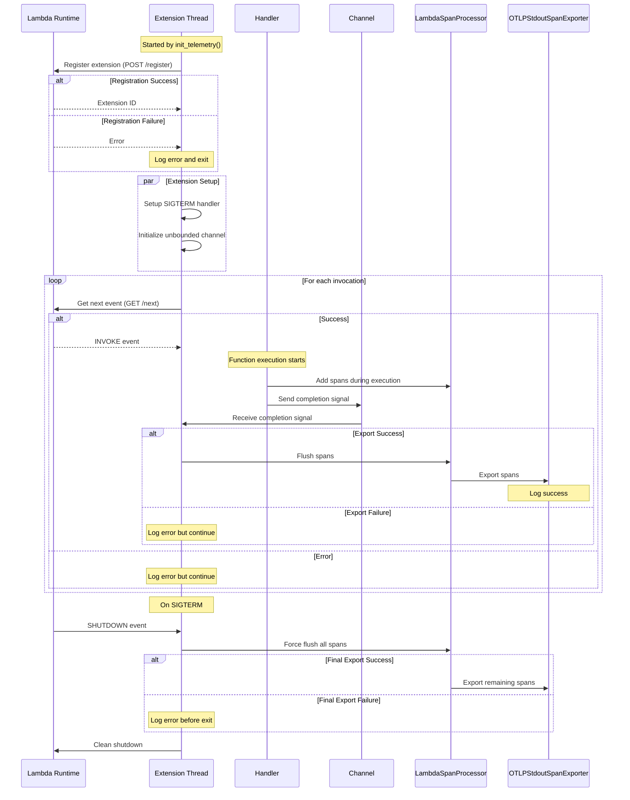

# Lambda OTel Lite

The `lambda-otel-lite` crate provides a lightweight, efficient OpenTelemetry implementation specifically designed for AWS Lambda environments. It features a custom span processor and internal extension mechanism that optimizes telemetry collection for Lambda's unique execution model.

By leveraging Lambda's execution lifecycle and providing multiple processing modes, this crate enables efficient telemetry collection with minimal impact on function latency. By default, it uses the `otlp-stdout-span-exporter` to export spans to stdout for the [serverless-otlp-forwarder](https://github.com/dev7a/serverless-otlp-forwarder) project.

>[!IMPORTANT]
>This crate is highly experimental and should not be used in production. Contributions are welcome.

## Features

- **Flexible Processing Modes**: Support for synchronous, asynchronous, and custom export strategies
- **Automatic Resource Detection**: Automatic extraction of Lambda environment attributes
- **Lambda Extension Integration**: Built-in extension for efficient telemetry export
- **Efficient Memory Usage**: Fixed-size ring buffer to prevent memory growth
- **AWS Event Support**: Automatic extraction of attributes from common AWS event types
- **Flexible Context Propagation**: Support for W3C Trace Context and custom propagators

## Architecture and Modules

The crate follows a modular architecture where each component has a specific responsibility while working together efficiently:


- [`telemetry`](https://docs.rs/lambda-otel-lite/latest/lambda_otel_lite/telemetry/index.html): Core initialization and configuration
  - Main entry point via `init_telemetry`
  - Configures global tracer and span processors
  - Returns a `TelemetryCompletionHandler` for span lifecycle management

- [`processor`](https://docs.rs/lambda-otel-lite/latest/lambda_otel_lite/processor/index.html): Lambda-optimized span processor
  - Fixed-size ring buffer implementation
  - Multiple processing modes
  - Coordinates with extension for async export

- [`extension`](https://docs.rs/lambda-otel-lite/latest/lambda_otel_lite/extension/index.html): Lambda Extension implementation
  - Manages extension lifecycle and registration
  - Handles span export coordination
  - Implements graceful shutdown

- [`resource`](https://docs.rs/lambda-otel-lite/latest/lambda_otel_lite/resource/index.html): Resource attribute management
  - Automatic Lambda attribute detection
  - Environment-based configuration
  - Custom attribute support

- [`extractors`](https://docs.rs/lambda-otel-lite/latest/lambda_otel_lite/extractors/index.html): Event processing
  - Built-in support for API Gateway and ALB events
  - Extensible trait system for custom events
  - W3C Trace Context propagation

The crate provides two integration patterns, each suited for different use cases:

- [`layer`](https://docs.rs/lambda-otel-lite/latest/lambda_otel_lite/layer/index.html): Tower middleware integration
  - Best for complex services with middleware chains
  - Integrates with Tower's service ecosystem
  - Standardized instrumentation across services

- [`handler`](https://docs.rs/lambda-otel-lite/latest/lambda_otel_lite/handler/index.html): Direct function wrapper
  - Best for simple Lambda functions
  - Lower overhead for basic use cases
  - Quick integration with existing handlers

## Installation

Add the crate to your project:
```bash
cargo add lambda-otel-lite
```

## Processing Modes

The crate supports three processing modes for span export:

1. **Sync Mode** (default):
    This is the safe, conservative default mode, and it's not relying on the lambda internal extension.
   - Direct, synchronous export in handler thread
   - Recommended for low-volume telemetry or when latency is not critical
   - Set via `LAMBDA_EXTENSION_SPAN_PROCESSOR_MODE=sync`

2. **Async Mode**:
    This mode is using the lambda internal extension to defer the span export until after the response is sent to the user.
   - Export via Lambda extension using AWS Lambda Extensions API
   - Spans are queued and exported after handler completion
   - Uses channel-based communication between handler and extension
   - Registers specifically for Lambda INVOKE events
   - Implements graceful shutdown with SIGTERM handling
   - Error handling for:
     - Channel communication failures
     - Export failures
     - Extension registration issues
   - Best for production use with high telemetry volume
   - Set via `LAMBDA_EXTENSION_SPAN_PROCESSOR_MODE=async`

3. **Finalize Mode**:
    This mode only registers the extension with no events, to ensure that the SIGTERM handler is installed. It leaves the actual span export to the application code, typically using the `BatchSpanProcessor` or another periodic export strategy.
   - Registers extension with no events
   - Maintains SIGTERM handler for graceful shutdown
   - Ensures all spans are flushed during shutdown
   - Compatible with BatchSpanProcessor for custom export strategies
   - Best for specialized export requirements where you need full control
   - Set via `LAMBDA_EXTENSION_SPAN_PROCESSOR_MODE=finalize`

## Processing Modes Architecture

The async mode leverages Lambda's extension API to optimize perceived latency by deferring span export until after the response is sent to the user:



## Usage

## Telemetry Configuration

The crate provides several ways to configure the open telemetry tracing pipeline, which is a required first step to instrument your lambda function:

### Basic usage with default configuration:
```rust no_run
use lambda_otel_lite::{init_telemetry, TelemetryConfig};
use lambda_runtime::Error;

#[tokio::main]
async fn main() -> Result<(), Error> {
    let completion_handler = init_telemetry(TelemetryConfig::default()).await?;
    // ...
    Ok(())
}
```

### Custom configuration with custom resource attributes:
```rust no_run
use lambda_otel_lite::{init_telemetry, TelemetryConfig};
use opentelemetry::KeyValue;
use opentelemetry_sdk::Resource;
use lambda_runtime::Error;

#[tokio::main]
async fn main() -> Result<(), Error> {
    let resource = Resource::new(vec![
        KeyValue::new("service.version", "1.0.0"),
        KeyValue::new("deployment.environment", "production"),
    ]);

    let config = TelemetryConfig::builder()
        .resource(resource)
        .build();

    let completion_handler = init_telemetry(config).await?;
    // ...
    Ok(())
}
```

### Custom configuration with context propagators:
```rust no_run
use lambda_otel_lite::{init_telemetry, TelemetryConfig};
use opentelemetry_sdk::propagation::{BaggagePropagator, TraceContextPropagator};
use lambda_runtime::Error;

#[tokio::main]
async fn main() -> Result<(), Error> {
    let config = TelemetryConfig::builder()
        // Add W3C Trace Context propagator (default)
        .with_propagator(TraceContextPropagator::new())
        // Add W3C Baggage propagator
        .with_propagator(BaggagePropagator::new())
        .build();

    let completion_handler = init_telemetry(config).await?;
    // ...
    Ok(())
}
```

Note: By default, the crate uses the W3C Trace Context propagator (`TraceContextPropagator`). You can add additional propagators using the `with_propagator` method. Multiple propagators will be combined into a composite propagator.

### Custom configuration with custom span processors:

```rust no_run
use lambda_otel_lite::{init_telemetry, TelemetryConfig};
use opentelemetry_sdk::trace::SimpleSpanProcessor;
use otlp_stdout_span_exporter::OtlpStdoutSpanExporter;
use lambda_runtime::Error;

#[tokio::main]
async fn main() -> Result<(), Error> {
    let config = TelemetryConfig::builder()
        .with_span_processor(SimpleSpanProcessor::new(
            Box::new(OtlpStdoutSpanExporter::default())
        ))
        .library_name("instrumented-service".to_string())
        .enable_fmt_layer(true)
        .build();

    let completion_handler = init_telemetry(config).await?;
    Ok(())
}
```
Note that the `.with_span_processor` method accepts a `SpanProcessor` trait object, so you can pass in any type that implements the `SpanProcessor` trait, and can be called multiple times. The order of the processors is the order of the calls to `.with_span_processor`.

### Using the Tower Layer
You can "wrap" your handler in the `OtelTracingLayer` using the `ServiceBuilder` from the `tower` crate:

```rust no_run
use lambda_otel_lite::{init_telemetry, TelemetryConfig, OtelTracingLayer};
use lambda_runtime::{service_fn, Error, LambdaEvent, Runtime};
use lambda_runtime::tower::ServiceBuilder;
use aws_lambda_events::event::apigw::ApiGatewayV2httpRequest;

async fn handler(event: LambdaEvent<ApiGatewayV2httpRequest>) -> Result<serde_json::Value, Error> {
    Ok(serde_json::json!({
        "statusCode": 200,
        "body": format!("Hello from request {}", event.context.request_id)
    }))
}

#[tokio::main]
async fn main() -> Result<(), Error> {
    // Initialize telemetry with default configuration
    let completion_handler = init_telemetry(TelemetryConfig::default()).await?;

    // Build service with OpenTelemetry tracing middleware
    let service = ServiceBuilder::new()
        .layer(OtelTracingLayer::new(completion_handler).with_name("tower-handler"))
        .service_fn(handler);

    // Create and run the Lambda runtime
    let runtime = Runtime::new(service);
    runtime.run().await
}
```

### Using the handler wrapper function
Or, you can use the `traced_handler` function to wrap your handler:

```rust no_run
use lambda_otel_lite::{init_telemetry, traced_handler, TelemetryConfig};
use lambda_runtime::{service_fn, Error, LambdaEvent, Runtime};
use aws_lambda_events::event::apigw::ApiGatewayV2httpRequest;

async fn handler(event: LambdaEvent<ApiGatewayV2httpRequest>) -> Result<serde_json::Value, Error> {
    Ok(serde_json::json!({
        "statusCode": 200,
        "body": format!("Hello from request {}", event.context.request_id)
    }))
}

#[tokio::main]
async fn main() -> Result<(), Error> {
    let completion_handler = init_telemetry(TelemetryConfig::default()).await?;
    
    // Create and run the Lambda runtime with the traced handler
    let runtime = Runtime::new(service_fn(|event| {
        traced_handler("my-handler", event, completion_handler.clone(), handler)
    }));

    runtime.run().await
}
```

### Custom Attribute Extraction

For other events than the one directly supported by the crate, you can implement the `SpanAttributesExtractor` trait for your own event types:

```rust no_run
use lambda_otel_lite::{init_telemetry, traced_handler, TelemetryConfig, SpanAttributes, SpanAttributesExtractor};
use lambda_runtime::{service_fn, Error, LambdaEvent, Runtime};
use serde::{Deserialize, Serialize};
use std::collections::HashMap;
use opentelemetry::Value;

// Define a custom event type
#[derive(Clone, Deserialize, Serialize)]
struct MyEvent {
    user_id: String,
    trace_parent: Option<String>,
}

// Implement SpanAttributesExtractor for the custom event
impl SpanAttributesExtractor for MyEvent {
    fn extract_span_attributes(&self) -> SpanAttributes {
        let mut attributes = HashMap::new();
        attributes.insert("user.id".to_string(), Value::String(self.user_id.clone().into()));

        // Add trace context if available
        let mut carrier = HashMap::new();
        if let Some(header) = &self.trace_parent {
            carrier.insert("traceparent".to_string(), header.clone());
        }

        SpanAttributes::builder()
            .attributes(attributes)
            .carrier(carrier)
            .build()
    }
}

async fn handler(event: LambdaEvent<MyEvent>) -> Result<serde_json::Value, Error> {
    Ok(serde_json::json!({
        "statusCode": 200,
        "body": format!("Hello, user {}", event.payload.user_id)
    }))
}

#[tokio::main]
async fn main() -> Result<(), Error> {
    let completion_handler = init_telemetry(TelemetryConfig::default()).await?;
    
    // Create and run the Lambda runtime with the traced handler
    let runtime = Runtime::new(service_fn(|event| {
        traced_handler("my-handler", event, completion_handler.clone(), handler)
    }));

    runtime.run().await
}
```


## Automatic FAAS Attributes

The crate automatically sets relevant FAAS attributes based on the Lambda context and event:

| Attribute Type | Attribute Name | Source | Description |
|----------------|----------------|---------|-------------|
| Resource Attributes | `cloud.provider` | "aws" | Cloud provider identifier |
| | `cloud.region` | AWS_REGION | AWS region where function runs |
| | `faas.name` | AWS_LAMBDA_FUNCTION_NAME | Lambda function name |
| | `faas.version` | AWS_LAMBDA_FUNCTION_VERSION | Function version ($LATEST or version number) |
| | `faas.instance` | AWS_LAMBDA_LOG_STREAM_NAME | Unique instance identifier |
| | `faas.max_memory` | AWS_LAMBDA_FUNCTION_MEMORY_SIZE | Maximum memory in bytes |
| | `service.name` | OTEL_SERVICE_NAME or function name | Service identifier |
| | Additional attributes | OTEL_RESOURCE_ATTRIBUTES | Custom key-value pairs |
| Span Attributes | `faas.coldstart` | Runtime detection | Boolean flag set to true only on first invocation of a new instance |
| | `faas.invocation_id` | Lambda request ID | Unique invocation identifier |
| | `cloud.account.id` | Function ARN | AWS account ID |
| | `cloud.resource_id` | Function ARN | Complete function ARN |
| | `otel.kind` | "SERVER" (default) | Span kind |
| | `otel.status_code`/`message` | Response processing | Error details if applicable |
| HTTP Attributes | `faas.trigger` | Event type detection | "http" for API/ALB events |
| | `http.status_code` | Response | HTTP status code if present |
| | `http.route` | Event source | Route key or resource path |
| | `http.method` | Event source | HTTP method |
| | `url.path` | Event source | Request path |
| | `url.query` | Event source | Query parameters if present |
| | `url.scheme` | Event source | Protocol (https) |
| | `network.protocol.version` | Event source | HTTP version |
| | `client.address` | Event source | Client IP address |
| | `user_agent.original` | Event source | User agent string |
| | `server.address` | Event source | Server hostname |

The crate automatically detects API Gateway v1/v2 and ALB events and sets the appropriate HTTP attributes. For HTTP responses, the status code is automatically extracted from the handler's response and set as `http.status_code`. For 5xx responses, the span status is set to ERROR.

## Distributed Tracing with non-HTTP events

The crate supports distributed tracing across service boundaries. For supported event types like API Gateway and ALB, context propagation is handled automatically. For other event types, you can implement the `SpanAttributesExtractor` trait and provide the carrier for the trace context:

```rust no_run
use lambda_otel_lite::{init_telemetry, TelemetryConfig, OtelTracingLayer, SpanAttributes, SpanAttributesExtractor};
use lambda_runtime::{service_fn, Error, LambdaEvent, Runtime};
use serde::{Deserialize, Serialize};
use std::collections::HashMap;
use lambda_runtime::tower::ServiceBuilder;
use serde_json::Value as JsonValue;
use opentelemetry::Value;

// Define a custom event type with W3C trace context fields
#[derive(Clone, Deserialize, Serialize)]
struct MyCustomEvent {
    // W3C trace context fields
    traceparent: Option<String>,
    tracestate: Option<String>,
    // Business fields
    operation_id: String,
    timestamp: String,
}

// Implement SpanAttributesExtractor for the custom event
impl SpanAttributesExtractor for MyCustomEvent {
    fn extract_span_attributes(&self) -> SpanAttributes {
        let mut attributes = HashMap::new();
        attributes.insert("operation.id".to_string(), Value::String(self.operation_id.clone().into()));
        attributes.insert("event.timestamp".to_string(), Value::String(self.timestamp.clone().into()));

        // Extract W3C trace context if available
        let mut carrier = HashMap::new();
        if let Some(traceparent) = &self.traceparent {
            carrier.insert("traceparent".to_string(), traceparent.clone());
        }
        if let Some(tracestate) = &self.tracestate {
            carrier.insert("tracestate".to_string(), tracestate.clone());
        }

        SpanAttributes::builder()
            .attributes(attributes)
            .carrier(carrier)
            .build()
    }
}

async fn function_handler(event: LambdaEvent<MyCustomEvent>) -> Result<JsonValue, Error> {
    // Access the event payload
    let operation_id = event.payload.operation_id;
    
    Ok(serde_json::json!({
        "message": format!("Processed operation {}", operation_id)
    }))
}

#[tokio::main]
async fn main() -> Result<(), Error> {
    // Initialize telemetry with default configuration
    let completion_handler = init_telemetry(TelemetryConfig::default()).await?;

    // Create a service with the OtelTracingLayer
    let service = ServiceBuilder::new()
        .layer(OtelTracingLayer::<MyCustomEvent>::new(completion_handler))
        .service_fn(function_handler);

    // Start the Lambda runtime
    Runtime::new(service).run().await
}
```

The above example shows how to implement distributed tracing for custom events. The `MyCustomEvent` type includes the standard W3C trace context fields (`traceparent` and `tracestate`). When an event is published to your Lambda function, the downstream service should include these trace context headers. The `SpanAttributesExtractor` implementation extracts these headers, allowing the Lambda function's spans to be properly connected to the downstream service's trace.

## Environment Variables

The crate can be configured using the following environment variables:

### Processing Configuration
- `LAMBDA_EXTENSION_SPAN_PROCESSOR_MODE`: Controls span processing strategy
  - `sync`: Direct export in handler thread (default)
  - `async`: Deferred export via extension
  - `finalize`: Custom export strategy
- `LAMBDA_SPAN_PROCESSOR_QUEUE_SIZE`: Maximum number of spans to queue in the ring buffer (default: 2048)

### Resource Configuration
- `OTEL_SERVICE_NAME`: Override the service name (defaults to function name)
- `OTEL_RESOURCE_ATTRIBUTES`: Additional resource attributes in key=value,key2=value2 format

### Export Configuration
- `OTLP_STDOUT_SPAN_EXPORTER_COMPRESSION_LEVEL`: Gzip compression level for stdout exporter
  - 0: No compression
  - 1: Best speed
  - 6: Good balance between size and speed (default)
  - 9: Best compression

### Logging and Debug
- `LAMBDA_TRACING_ENABLE_FMT_LAYER`: Enable console output of spans for debugging (default: false)
- `RUST_LOG` or `AWS_LAMBDA_LOG_LEVEL`: Configure log level for the crate
  - `RUST_LOG` takes precedence if both are set
  - Example: `RUST_LOG=lambda_otel_lite=debug`
  - Example: `AWS_LAMBDA_LOG_LEVEL=DEBUG` (used if RUST_LOG is not set)

## License

This project is licensed under the MIT License - see the [LICENSE](LICENSE) file for details. 